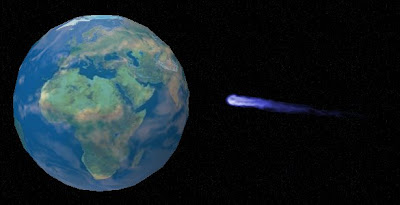

# 20 ways the world could end

*Author: Steve*
*Published on: 2007-02-28T13:10:00.000-05:00*

---

  
[Discover.com](http://www.discover.com) has an interesting list of the top 20 ways the world could end.  
  
1 Asteroid impact   
2 Gamma-ray burst   
3 Collapse of the vacuum   
4 Rogue black holes  
5 Giant solar flares  
6 Reversal of Earth's magnetic field   
7 Flood-basalt volcanism In   
8 Global epidemics   
9 Global warming  
10 Ecosystem collapse   
11 Biotech disaster   
12 Particle accelerator mishap   
13 Nanotechnology disaster   
14 Environmental toxins   
15 Global war   
16 Robots take over   
17 Mass insanity  
18 Alien invasion  
19 Divine intervention  
20 Someone wakes up and realizes it was all a dream  
  
Check out [the source](http://www.discover.com/issues/oct-00/features/featworld/) for much more indepth analysis. 