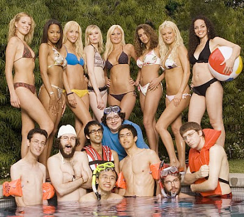

  
Here's a sneak peak at what's on primetime this winter, covered in full by [realitytvworld.com](http://www.realitytvworld.com/news/2007-reality-tv-winter-preview-coming-soon-tv-near-you-4477.php)  
  
Besides the such expected shows as The Apprentice and American Idol to air, there are a few that still catch my eye, such as this *Beauty and the Geek*. I'm not a big fan of the host Ashton Kutcher, but if the show is anything like my memories of the time I took my friend, doing his double PhD in math, to a dance club to pick up one crazy night, it should be a hoot!  
  
[note: I know its already on season 3. I don't watch much TV though...]  
  
[Link](http://www.realitytvworld.com/news/2007-reality-tv-winter-preview-coming-soon-tv-near-you-4477.php)  
  
