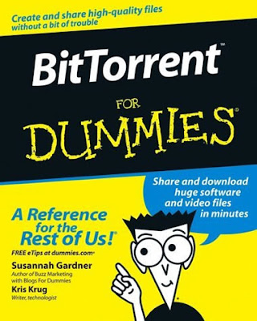

  
[Torrentfreak](http://torrentfreak.com/2007-bittorrent-predictions/) has some amusing bittorrent related predications for 2007. My favorite:  
  

> **RIAA sues unborn child.**  
> The RIAA continues to screw whatever few customers they still have and announces a round of lawsuits against unborn children of suspected pirates. They later announce that every citizen of the newly founded Pirate state (deceased, alive, yet to be born or even conceived) owes them 99,999999 trillion US dollars.

  
[Here's the link](http://torrentfreak.com/2007-bittorrent-predictions/)  

