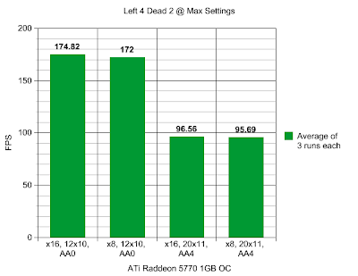
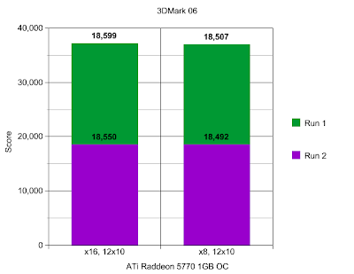
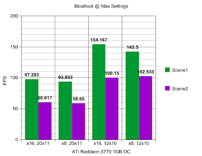

  
In this article I will reveal the differences one should expect from running an ATi Radeon HD 5770 1GB graphics card at full and half PCIe 2.0 bandwidth.  
  
This is particularly important data for those considering a dual ATI 5770's Crossfire setup on today's Intel-based P55 motherboards which generally offer only a single PCIe x16 slot or two PCIe x8 slots. Are you better off with a X58 motherboard for Crossfire that offers dual PCIe x16 slots? Would just a more powerful single slot graphics card, such as an ATI 5870, be a better call? I can't tell you that, since you may find Crossfire annoying or you may want the absolute best performance from your rig. What I can show you though is if Crossfire on a P55 motherboard is a viable option, especially for those trying to save a quick buck. Read on!  
  
While other reviews of limited PCIe bandwidth have been addressed prior, such as at Tom's Hardware, these looked at either [now-out-dated](http://www.tomshardware.com/reviews/pci-express-2.0,1915-10.html) video cards or [very expensive graphics cards](http://www.tomshardware.com/reviews/p55-pci-express-scaling,2517-10.html) that are far more demanding on bandwidth requirements than the now popular ATI 5770. Considering these results, I'm hypothesizing my own results with an ATI 5770 to show a 3% difference, but let's test and find out for sure!  
  
Test System  
  
Intel Core i7 860 @ 4.0 GHz  
2x2GB DDR3 RAM  
Windows Vista 32bit  
Sapphire ATI Radeon HD 5770 1GB, overclocked slightly to 900/1300  
Seasonic 850W PSU  
Gigabyte P55A-UD4P Motherboard  
  
Benchmarks Software: Bioshock (custom run), Left 4 Dead 2 (timedemo), Futuremark 3DMark 06  
Resolutions used: 2048 by 1152 and/or 1280 by 1024.  
  
The CPU has been overclocked to 4GHz. This was done for multiple reasons, but mainly to ensure that our benchmarks are not CPU power-limited and to represent the speed of any faster processors that might be used in a P55-based system.  
  
The motherboard used in this test supports PCIe x16 or PCIe x8+x8, [unlike some other cheaper P55 motherboards](http://www.hardware-revolution.com/p55-motherboards-crossfire-sli-performance-problem/) that lack support for the latter option. Be careful when making your purchase! I will be testing the ATI 5770 in both the x16 slot and the secondary x8 slot for this comparison.  
  
If your P55 motherboard can only do x8+x4, feel free to check out [this article](http://www.tomshardware.com/reviews/p55-pci-express-scaling,2517-6.html) to gain an idea of how much performance you might expect to gain with Crossfire. (Hint: My guess is that it would be around 15% less than with a PCIe x8+x8 Crossfire setup, but it may none the less still increase your average frame rate by about 33%) It wouldn't make much sense to intentionally buy a motherboard for Crossfire if it can only do x8+x4, but if you already have such a system, it is up to you if you feel such an upgrade is worth it.  
  
I'd like to also quickly mention that the motherboard I am using has USB 3.0 and SATA 6.0 support, however when fully enabling either of these new technologies with this particular board, it takes away half the bandwidth of the main x16 PCIe slot, downgrading it to a x8 PCIe slot. This leaves no extra bandwidth for a secondary x8 PCIe slot if desired, eliminating Crossfire as a viable option and reducing the available bandwidth of your primary graphics card to half. You might be running x8 PCIe and not even know it! The Gigabyte P55A-UD7 board I believe mostly fixes this issue, but it's costly. It too is a P55 motherboard, however it adds a special chip to improve [how bandwidth is managed](http://www.tomshardware.com/reviews/usb-3.0-sata-6gb,2583-2.html). Considering an X58 motherboard instead of the P55A-UD7 in this particular case might be a viable financial alternative if this concerns you.  
  
Please note the fact the ATI 5770 card being used is slightly overclocked and has 1GB of memory; not just 512MB. Having less memory can potentially result in greater variations from what will be explored here today, but I will be testing two different games at both high and low resolutions. At higher resolutions, it is assumed that there is a greater demand for bandwidth by the video card, but having a video card with more memory can potentially alleviate this demand a bit by having the video card relying less on the main system's RAM. Keep this in mind when making your purchase.  
  
Unfortunately, this test will be partially incomplete for the foreseeable future, as I will not be including any comparative data from a X58-based system in Crossfire, instead I will just be using a single ATI 5770 graphics card. In the future I will add the related comparative results, but I haven't yet ordered a second ATi 5770 yet to test! It's why I did this test, so I could see if it would be worth getting another.  
  
Results  
With L4D2, at 1280x1024 resolution, there was less than a 2% difference between having our overclocked ATI 5770 in the x16 and x8 PCIe slots. At the higher 2048x1152 resolution, with anti-aliasing set to 4, there was less than a 1% difference. It does not appear that these results were CPU limited.  
  
I ran each test in 3DMark06 twice, which I have stacked together in this graph. There is less than a single percent difference between PCIe x8 and PCIe x16 here.  
  
The last test was a free run test in Bioshock, since there was no easy benchmarking tool available, and as such the results might not be as accurate as the other tests. I did two different runs, each at different parts of the game, to give some variation. The performance variations ranged from just over 2% to as high as 8%, with 4% being about the median average. These results do not appear to be CPU limited.  
  
Initial Conclusions  
  
While the benchmark suite used was not very comprehensive, it demonstrates that an ATI Radeon HD 5770 1GB, even one that is overclocked, does not really max out the bandwidth provided by the PCIe x8 slot that often or by very much.  
  
The overall average difference in performance from using a PCIe x16 slot and a x8 slot is about just 2%. This lines up with our own personal hypothetical expected result of 3%, whereas other similar benchmarks with just different systems from other reviewers showed an average difference of about just [4%](http://www.tomshardware.com/reviews/p55-pci-express-scaling,2517-11.html) to [8%](http://www.tomshardware.com/reviews/crossfire-meets-pci-express,1761-13.html). It seems a bit strange to us that there is such variation among different review sites with such a similar experiment, but it is possible that including even more demanding video benchmarks on our part could see our results change. We did use a very fast system to perform our tests on though and we did our best to reduce any probable error by limiting system variables and repeating tests to ensure precision. A  
  
In terms of Crossfire performance with the ATI 5770, we can extrapolate our results to make the assumption that there would be an overall difference of also only about 2% between a PCIe x16+x16 setup and a x8+x8 setup. Even if the actual difference was double that, it would still be a negligible difference. Testing will indeed be the only way to show for sure, but from [previous tests](http://www.tomshardware.com/reviews/crossfire-meets-pci-express,1761-13.html) of the same nature from [other review sites](http://www.tomshardware.com/reviews/p55-pci-express-scaling,2517-11.html), we feel we are making a safe assumption.  
  
At the end of the day, whether you still instead decide to purchase a single graphics card solution or an X58 motherboard for Crossfire, the lack of dual PCIe x16 slots on the Intel P55 platform does not hinder its ability to make it a good Crossfire platform. Dual ATI 5770 graphics cards on a capable P55 motherboard should be in no uncertain terms a powerful gaming rig.