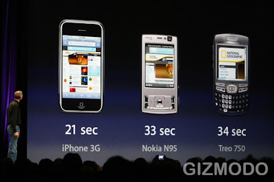

  
General Keynote Overview  
* Lots of free mobile applications, such as eBay and geo-based social networking.
* Lots of games and tools @ $ 9.99
* Incoming alerts when using an application.
* None of this until early July!!! boo!
* iPhone 3G /w better battery life, GPS, and slight design improvements! yess!
* 199$/299$ for 8GB/16GB
* Released July 11th in 22 countries.
* White and black options.

  
Detailed Apple Keynote Timeline:  
  
* It begins...
* Steve Jobs look under fed and over worked.
* Sneak peak of Snow Leopard.
* Apple's SDK 4000 developers, many of which are top 500.
* Rambling about iPhone's success.
* More rambling, recapping about the iPhone.
* Talking about the SDK and API and compatibilities with MacOS.
* They seem to be stalling the keynote with lots of filler.
* Demonstrating development tools.
* Location-based contact filtering.
* Demoing some SEGA game.
* $ 9.99 ... for a cell phone game?
* eBay iPhone application.
* Location-based social networking application.
* Loopt? Free? Not bad. Twitter competition.
* TypePad blogging software. Looks half-baked?
* An RSS feed reader.. exciting...
* Associate Press news tip poster thingy.
* More games. Physics-based. $9.99
* Music creation application.
* Sports game stats and video highlight app.
* Apple stock down. LOL. People want a phone, not 10$ apps!
* Medical visualization tool for med students.
* CT and PET image viewer app.
* Some 3D third person game. Still under development.
* There is no background processing. I dont care what they say, this is limiting.
* They have sort of push notificiation system to make up for this. We'll see....
* Some new features, like bulk delete, parental control, permissions, etc.
* iPhone 2.0 software RELEASED early July. GAH!!!
* Free for iPhone owners, 9.95 for iTouch users.
* Apple takes 30% of application revenues.
* Apps less than 10megs can be downloaded over cellular networks.
* More apps, but there suddenly is a lack of interest considering the release date...
* iDisk, file sharing.
* No cut and pasting still?
* Lots of obvious apps, like calendars and calculators and email.
* People getting more and more discouraged with the lack of iPhone.
* Mobile.Me is talked about, 99$/year. Feels like they are trying to catch up with RIM.
* Includes 20Gigs of storage, up from 10gb of the .Net service.
* Why not just use Google's offerings, that are free?
* Mobile.Me is for consumers, but no consumer wants to pay 100$/year for email.
* I think I'm going to buy the new Blackberry Bold instead.
* iPHONE 3G!!!!!!! INTRODUCED!
* It’s thinner at the edges, has a full plastic back, solid metal buttons, 3.5-inch display, camera, FLUSH HEADPHONE JACK, and improved audio.
* No video chat....
* EDGE vs 3G, 2.8X faster.
* The 3G iPhone’s standby is 300 hours. 2G talk time is up to 10 hours from 8 hours. 3G talk time is 5 hours. (Jobs says other phones have about 3 hours.) Browsing, 5-6 hours of 3G browsing. Video is 7 hours, and audio is 24 hours.
* Wifi loads in 17 seconds.
* GPS! YES!
* Rambling about location-based services being the 'next thing'.
* 6 counties covered, including Canada and Mexico.
* A demo.
* No China or Russia
* 70 Countries will be getting the iPhone 3G in the next several months.
* 199$ for 8gB iPhone
* 299$ for 16gB
* White version also.
* July 11th roll out date in 22 countries.
* A new ad with two guys carrying a metal case.
* The end.

