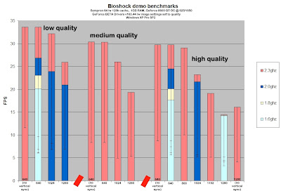
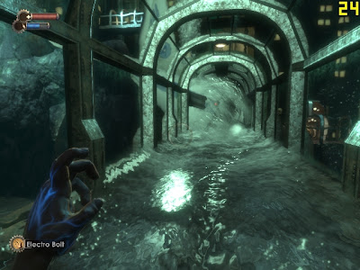

# Bioshock Benchmarks

*Author: Steve*
*Published on: 2007-08-27T18:15:00.000-04:00*

---

For those who are interested, I have done some BioShock benchmarks.  
  
  
  
keeping in mind that i have the nvidia driver set to max quality during these runs, and that i did these runs at a location where there was sufficient processing requirements, here are the benchmarks i got for XP with my comp. FPS taken with FRAPS. Adjustment of the CPU speed also altered RAM and FSB speeds, proportionally.  
  
I plan to do the same for Vista and with AA off in XP soon. (AA is currently on in these runs).  
   
  
  
The run was 45 seconds long roughly. Down the and back again in the passage way (thru the plane) where there is a major leak due plane debris. There is intense water action going on.  
  
things to note:  
-On the highest quality settings and resolution, it is clear my video card is unable to keep up with the CPU at all frequencies.  
-vertical sync has no effect towards the CPU's performance. It does however put a small strain on the video card. vertical sync is important, as it reduces the tearing effect that was quite apparent.  
-800x600 and 640x480 have little difference in frame rates, and at lower quality settings, 640x480 and 1024x768 begin to show little difference.   
-Lowering the CPU frequency prevents higher frame rates at lower resolutions and quality settings.   
-The previous two points would lead me to believe my CPU bottlenecks at around 30 frames a second with all static variables invovled in this test.  
-I noticed, that with AA on and quality on high, even with lower resolution settings, the game looks pleasing to the eye and is quite immersive. I actually prefer the softness of lower resolutions to the sharp edges of my monitor's native high resolution. Taking into consideration for the importance of frame rates and the lack of importance of resolution, I think until i run tests with AA on lower settings, 800x600 on high quality is my best option. maybe even tweak my cpu up to 2.6ghz for a few extra frames/sec...  
  
or rather, my best option is to get a new MB/CPU/RAM....  
  
For you reference, 2KGames recommends the following system settings:  
  

> Minimum System Requirements  
> -------------------------------  
>   
> CPU: P4 2.5 GHz single core.  
> System RAM: 1GB   
>   
> Recommended System Requirements  
> -----------------------------------  
>   
> CPU: 3GHz dual core processor  
> System RAM: 2 GB  
>   
> =====================================================================  
>  Performance  
> =====================================================================  
>   
>  Resolution  
> --------------  
>   
> It is recommended that when running the game on a minimum specification machine screen resolutions of either 640\*480 or 800\*600 be used. On a recommended specification machine resolutions of 1152\*864 should provide good performance. On a high end machine 1280\*1024 on a standard 17 inch LCD monitor will give very good performance.  
>   
>  CPU Speed  
> -------------  
>   
> BioShock is optimized for dual core machines. If the game is run on a single core machine then a processor of 2.5GHz or better is required to get reasonable performance. The higher the clock speed of the processor the better the game will run. Most dual core machines will be optimum for BioShock  
>   
>  Memory  
> ----------  
>   
> Memory or RAM can sometimes greatly affect game play. Machines with less memory will access their hard disk more frequently to load data, which causes sporadic pauses in game play. Machines with a lower end processor and video card that has 256 MB of RAM or less, should make sure that there are no active running programs in the background. This will optimize performance and make the gaming experience better for the user.  
>   
> For good performance we recommend at least 1 Gigabyte of system memory. For optimum performance we recommend at least 2 Gigabyte of system memory.  
>   
>  Better Performance for your Game  
> ------------------------------------  
>   
> A faster graphics card on a slower PC may receive significantly increased frame rates and performance benefits when Shadow Maps are turned off and Texture Detail, High Detail Post Processing, and Real Time Reflection mapping is also turned off.  
>   
> For best performance, we recommend a dual core processor and either a Nvidia 8800 or an ATI(R) Radeon(TM) X1950 or 2900XT equivalent card.  
>   
> If performance issues are observed then it is recommended that the user selects a lower screen resolution and lower details setting from the video options screen. If the user is not using an EAX(R) compatible sound card then disabling "reverb" from the audio options screen will also improve performance.  
> --

  
  
I would strongly take their recommendations to heart, as they do reflect the same results I experienced with my testing here.  
  
  
gah.  
  
ciao.