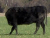

# Cloned meat

*Author: Steve*
*Published on: 2007-01-03T02:07:00.000-05:00*

---

  
The sale of meat and milk from cloned animals moved a step closer the other day after the US Government (FDA) ruled that the products were safe to eat and could be sold in supermarkets without labelling.  
  
This does not mean it will be happening anytime soon as [the FDA is hoping for public feedback on their announcement](http://www.accessdata.fda.gov/scripts/oc/dockets/comments/commentdocket.cfm?AGENCY=FDA) first before taking its next step.  
  
I don't see how it won't happen. Its eventual, whether agreed upon or not. What really should be up for debate is *genetically modified* meat and milk products. Milk with double the calcium? Pork with no cholesterol!? Who knows, we may not be far off from just growing our steaks directly in a test tube, brain-free and all!  
  
[Source](http://www.fda.gov/cvm/CloneRiskAssessment.htm)