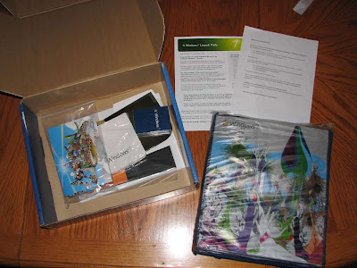

On October 22nd, Microsoft will be launching its newest Windows operating system - Windows 7. To celebrate the event, Microsoft has been providing party packs this week to the thousands of individuals around the world who signed up last month to host a [Windows 7 Launch Party](http://houseparty.com/windows7). These parties will be taking place from October 22nd to October 29th in 12 countries.  
  
I signed up last month to host a Windows Launch Party and while the idea [seemed a bit hokey at first](http://www.youtube.com/watch?v=9oWWt_L-qeo), I was pretty excited to see that I was selected as a finalist party host; not everyone got accepted it seems. So yes, later this month I will be throwing a Windows 7 Launch Party and although most of my guests had never heard of Windows 7 before, they all seem excited about the getting trashed part at least. Should be fun.  
  
Anyways, today I received my party pack, which included a copy of Windows 7 Ultimate Signature Edition and some party favors. While it is a bit neat to now have a real copy of Windows 7 before the October 22nd release date, who hasn't already used or installed a pre-release version of Windows 7? (Apple fan-boys excluded). No surprises here.  
  
For some fun though I have taken photos of the party pack and its contents, which are posted below. Party hosts did have a choice of party themes (Setting Up With Ease, Family Friendly Fun, Media Mania, or PhotoPalooza); I picked the PhotoPalooza theme. Other than the choice of theme, all party hosts should have received the same contents, with the exception of residents in the USA. Apparently USA residents also get streamers, balloons and a chance to win a $750 computer; something to that effect at least.  
  
  
The packaging for the party pack came in a plain blue box with a small Windows 7 logo on it.  
  
  
A large photo-themed poster.  
  
The copy of Windows 7 Ultimate, with an embossed signature by Steve Ballmer. Not the full retail packaging it seems. :(  
  
Both 32bit and 64bit install discs are included; it says "Promotional Disc: Not for resale" on the discs.  
  
Back of it.  
  
Ugh.  
  
The included deck of cards was a great idea; drinking games await! Not very Windows 7-ish looking at all.  
  
Napkins - for soaking up spilled drinks I guess.  
  
  
A puzzle, un-assembled. It will probably remain that way. We'll see though.  
  
At first I thought the copy of Windows 7 Ultimate would be the best part of this party pack, but since I have been using Windows 7 since January now and already pre-ordered several other copies of Windows 7, I was actually a bit more excited about these ten tote bags. In my area they have essentially banned plastic bags recently, so I've been forced to use ugly store-branded tote bags for my groceries. Windows 7-branded tote bags pleases my inner geek greatly, even though I know I will be giving them all away to guests at the party. Maybe I'll be greedy and keep one.