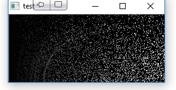
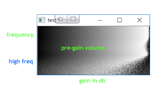

# Exploration: Reversing compression

*Author: Steve*
*Published on: 2017-11-13T01:57:00.001-05:00*

---

  

So I figured I'd do a plot of some sort to visualize what is going on. My first attempt was a bit spotty, and didn't really provide results I trusted. So I tried again.

  

  

  
Volume Difference vs Linear Frequency

  

My second result seemed to make more sense, and thankfully was a bit more dynamic and smooth. This is what I was hoping for. The bottom half of the spectrum I feel like I can ignore, since that is the 11-khz range and up I think and isn't really that interesting to me. 

  

In regards to the main frequencies I'm interested in, things have a generally linear gradient to them. There is a bit of oddness at the far extreme right hand side of the plot, but a reduction in gain at the extreme makes some sense: you can't add a lot of gain when the volume is already at max. I'm just not quite sure why it's not more uniform.
  
