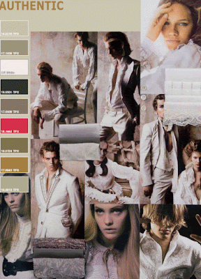

I'll say this once, and only once, but I am not a fashion expert by any means. I'll give this a try though, and hope for some constructive feedback. Oh fashion, where do I begin. Maybe some of you could help me out with tips, or at the very least, letting me know the moment you realize one fashion is catching on, so all you wonderful readers can be an early bird. Particularly, it would be lovely to have hints on current and upcoming mens fashions shared, especially from the female readers. Help us. Please.  
  
  
Regardless, here are some forecasts for this winter and spring. Above, as seen, a muted historical/classical theme is suggested by [CBI.](http://www.cbi.nl/marketinfo/cbi/?action=showDetails&id=56)   
  
[CIFF](http://www.cosmoworlds.com/ciff_fashion_trends_autumn_winter_2006_2007_01.htm) is suggesting a Barbarian Wedding theme, as shown, as well as a Doll's House, Heady Sins, and United Workers theme for this early winter.  
  
To top it off, for those needing a last minute choice for this holiday season, [OPI](http://www.opi.com/suzie.asp) has the following forecast.  

> THE FASHION Fashion offers the timeless elegance of an era like the Forties, but loosened up for today’s busy woman and her active lifestyle. It draws its inspiration from a myriad of luxurious styles, including Victorian, Jazz Age, the opulent Eighties, and touches of menswear – contrasted by a chic, spare look taken from urban streets. 
> 
> A fresh, effortless glamour rules the runways. In addition to fitted, feminine suits and new takes on the “little black dress”, we’ll see romantic full skirts, ruffles, and dresses that accentuate a woman’s curves. Little jackets with slim skirts or skinny trousers are big, as are sweater coats and blouson jackets. Cardigans combine with ball gowns to offer a perfect example of this new look at glamour.  
>   
> Plaid is everywhere, including worn with houndstooth-print jackets. Luxe embroidery, beading and fur make an appearance, as well as utterly feminine layers of lace.  
>   
> Cocktail dresses are fabulous now, especially with coordinating coats. Menswear influence is seen in neckties and military details. In counterpoint, look for dark colors and sleek, spare lines – a strong, primal, urban look that is glamorous in its lack of embellishment and elegant in its toughness.  
>   
> Deep, dark, sophisticated colors are the choice of the season, including rich browns, cinnamons, cognacs and brown-reds, black, shades of wine and deep greens.  
>  
> 
> 

