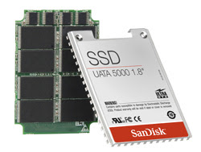

# Flashed based hard drives

*Author: Steve*
*Published on: 2007-01-05T04:01:00.000-05:00*

---

  
The future of hard drives will be solid state. Comparing to present day hard drives, which consist of magnetic round platters being spun at thousands of RPM, solid state drives require less energy to run, they are less prone to damage, physically smaller, noiseless, and potentially much faster in many ways. A limitation though of flash-based solid state hard drives today is that they are limited in data capacity comparatively, as well as being much more expensive.  
  
That is all slowly changing though. Sandisk this week has [announced](http://www.sandisk.com/Oem/Default.aspx?CatID=1478) that they are releasing a 32GB flash based hard drive targeted at enterprise users and likely high end laptops. As the prices of these drives drop and their sizes increase, it will only be a matter of time until the average consumer buys in.  
  
Until that day however, there is another option that is being brought to market. Hybrid HDD, a combination of both traditional magnetic memory and flash-based memory in a single hard drive. Using the flash memory of this drive for system files and other highly demanded data, program load times, such as the operating system, can be decreased drastically while also reducing energy needs. Windows Vista will support these new hybrid drives, which will greatly reduce system start up times.  
  
Although these new hybrid hard drives are coming out very soon, it is recommended that you pass on buying any of the first generation of these devices. Rather, wait until the second generation of these products are released or simply purchase a faster traditional hard drive while adding more system memory.  
  
  
On a related note, Seagate announced this week that by 2010 they will have a 300 [TB hard drive released.](http://www.itwire.com.au/content/view/8350/52/) It won't be a flash-based drive, but considering how today their largest offering is only 750 GB, 400 times smaller in capacity, thats incredible. Flash memory has a lot of catching up to do. [[update: 'Flash will kill Blu-ray and HD DVD']](http://www.theinquirer.net/default.aspx?article=36930)