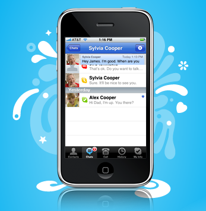

  
It seems every country was able to download and install Skype for the iPhone as of today... except for Canada. Apparently it was due to some patent-licencing issues.. I really wanted Skype though since I have unlimited incoming calls on my iPhone, but no long distance features and limited outgoing minutes; Skype-out would be a great way for me to save some money.  
  
Well, there is hope, Canada!  
  
Steps involved:  
  
1) Visit <http://www.tunecore.com/freealbum> and get a free iTunes promo code. If the link no longer works, Google is your friend when it comes to finding other valid US iTunes promo codes.  
2) In iTunes, select from the Menu, Store > View My Account and login.  
3) Select Change Country and follow the instructions.  
4) You will want to select US as the country and instead of using a Credit Card, just enter the promo code. The new address you enter needs to be US-based; Beverly Hills, 90210 is popular.  
5) When done, you can use the US iTunes App store (since your account is now set to US) to install Skype to your iPhone. (Syncing Apps with iTunes can be a pain bit of a pain in the butt, so if you are having problems with the syncing process, keep playing with it until you get it to work.)  
6) Skype should now be installed on your iPhone, but with your iTunes set for US, using your iPhone App store could be a problem. So, once Skype is installed, just repeat the above steps to change your Country setting in iTunes back to Canada.  
7) If you do not have a Credit card, or wish not to enter a Credit card number, [Dose.ca](http://www.dose.ca/music/artiststowatch/download.html) provides free promo codes that will allow you to bypass this step. American promo codes may not work.  
8) Now that your iTunes account is set back to Canadian, everything should be back to normal, except Skype will now be loaded on your iPhone.  
9) ENJOY!  
  
If you are having problems with my above method, [check out this site](http://www.ianbell.com/2009/03/31/iphone-skype-for-canada-a-workaround/), as it offers a slightly different method that should also work.  
  
[Update: Skype calls over 3G are disabled for some annoying reason, so only calls over WiFi seem to work. $4/month for skype versus $40/month for a cellular voice plan... I feel like I'm being scammed. gah!]