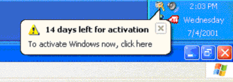
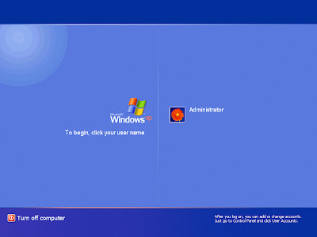
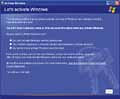
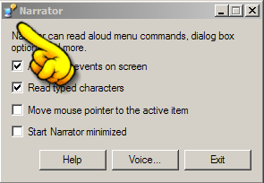
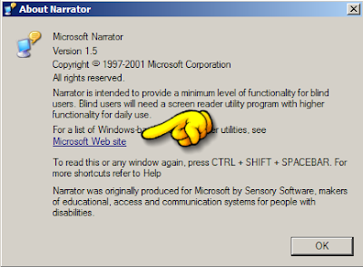
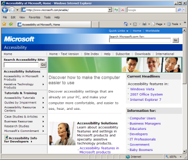

# How to login to an expired Windows

*Author: Steve*
*Published on: 2006-12-13T02:16:00.000-05:00*

---

 Microsoft has a neat little way to prevent software piracy of their Windows operating system. "Windows Genuine Advantage"[edit: I stand corrected, it has nothing to do with WGA] with its "Product Activation" requirement. Essentially, even with a valid product key, you still need to activate your Windows to ensure that only one computer is using that specific product key. If you can't activate your Windows, there being many reasons for this, you are left with a 30 day grace period to change your product key to one that is fully valid or get in contact with Microsoft and plea your case.  
  
Once your grace period is up, Windows refuses to let you login anymore. You cannot access your files. You cannot go on the Internet. You cannot do anything, except the thrill of trying to activate Windows.  
  
  
Well, luckily for me I do not have to worry about this issues, as my Windows is valid and activated. However, for those who do not and have been so unfortunate enough to have their Windows expire on them, I present to you a bit of relief. How to gain access to your files on an expired Windows, with even enough functionality to surf the web, talk on MSN Messenger, and load up most of your applications. It doesn't give you full functionality of Windows, but it will be enough to get the job done until you can *find the time* to activate your Windows. Best of all though, it's all very simple and easy to do!!!  
  
First, turn on your computer and wait until you get to the Windows login screen.  

Next, click to login as usual. You should get an error from Windows telling you that your Windows has expired and is asking whether you would like to activate Windows now. Click **Yes.**  
  
 

  
A "Let's activate Windows" window will appear. Let's minimize it. DO NOT close it.  

  
  
Now, hold down the Windows Key on your keyboard while you also press the "U" key. This will open up the Narrator program to help assist those with poor vision. It is this program that will help us login to our Windows.  
  
Click the little computer icon in the top left hand side of the Narrator window. A drop down menu should appear. The last option in this menu is named "About Narrator...". Click it. This should open up another window called "About Narrator". 

 In this window, there should be the text "Microsoft Web site". Click it, as it is a link and will open up your Internet Explorer, taking you to the Microsoft Accessibility website. Howrah! Internet access!  
  
As if Internet was not enough, in the address bar of Internet Explorer, type "c:\". This should display all your hard drive contents on drive "C". From there you can load navigate your way around your computer, loading specific programs, and most whatever else.

Some common directories as to where you can find personal files and programs are:

C:\program files\  
C:\documents and settings\*username*\Desktop\  
C:\documents and settings\*username*\Documents\  
C:\documents and settings\*username*\Start Menu\Programs\

On a side note, certain programs cannot be opened while Windows is still not activated. You will also not have a Task Bar at the bottom of your screen, as trying to open it will just result in it shutting itself down a few moments later. MSN Messenger works though, as well as most other non-Windows-based components.

  
**Disclaimer:** I do not applaud piracy, but I do feel people should have access to their personal files, regardless of whether Windows has expired or not. This tutorial should not be used to bypass Windows Activation, nor does it restore full Windows functionality, but I provide it to those who are in desperate need of accessing files that are suddenly lost to them through the Microsoft Genuine Advantage activation system. 

[***Update***: some say it works even better with Vista, as the explorer.exe does not close shortly after you try to open it as it does in XP. Unconfirmed.] 

