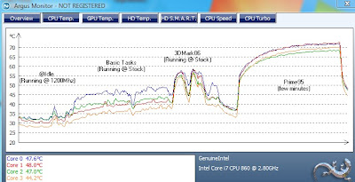
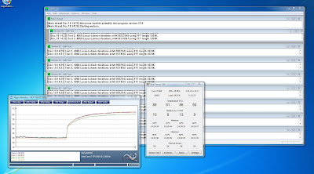
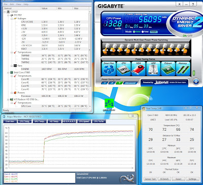

# Intel Core i7 860: Stock Cooler and Power Usage

*Author: Steve*
*Published on: 2009-12-10T11:51:00.000-05:00*

---

I'm just throwing this out there for anyone else running into similar problems as I have been having with my Intel Core i7 860 system. I'm noticing that a lot of heat is being produced from these chips when at full load and especially when overclocked, to the point that I feel the stock CPU cooler from Intel is simply inadequate. The included heatsink/fan included with the Intel Core i7 860 has a low-profile design that is smaller than previous Intel coolers, which seems a bit strange in my opinion considering that these chips are rated at 95W TDP.  
  
Anyways, I bought two Core i7 860 systems, one featuring a Gigabyte P55M-UD4 motherboard and another one using a Gigabyte P55A-UD4P motherboard (primary board used in this review). Using the stock Intel cooler, I could effortlessly overclock these systems to 3.5GHz using stock voltages. While the systems were stable for all intensive purposes, running Prime95 would cause the core CPU temperatures to shoot up quickly to 100\*C (using RealTemp). Even light gaming would cause the CPU temps to float around 80\*C, while idle temps bounced around at 50\*C. Obviously, using the system at these overclocked settings would be foolish - things get too hot and you may damage your system at these temperatures.  
  
Back at default stock system settings, with turbo mode enabled, temperatures barely became acceptable.  
(Auto default memory times, turbo on, default stock CPU settings, temps slowly rise to nearly ~80\*C)  
  
Using the included EnergySaver2 app (1.2GHz vs 2.8GHz) included with the Gigabyte motherboard, idle temps at stock settings (closed case, one case fans, arctic silver thermal paste, stock cooler) settled down to a range of 30\*C to 35\*C, according to RealTemp. Argus Monitor reported slightly lower core temperatures, hitting as low as 27\*C to 31\*C. Without the EnergySaver2 app enabled, idle temperatures quickly rose to the high 30\*C's and even mid 40\*C.  
  
  
(Above: Another attempt at stock CPU voltages/clocks and Prime95, but this time with tighter memory timings. Turbo on. RealTemp shows 91\*C was hit within a few minutes of running Prime95! ?)  
  
Running demanding applications, such as Prime95, stock core temperatures would reach as high as 91\*C - ouch. Things were a bit nicer with real world tasks however, such as 3DMark06, which never really made it into the 70\*C (according to RealTemp).  
  
I was able to reduce temperatures of the CPU @ stock speeds by undervolting it a bit. From ~1.22V to ~1.07V, the system remained stable. The system \*sometimes\* would POST/boot at voltages below 1.07V, but Windows would never load (BSOD) at voltages below ~1.0V. Undervolting the CPU did reduce the CPU power drain a bit, which is nice, and it did reduce the Core temperatures a bit too. At full load under Prime95, the maximum Core temps would peak at around 74\*C (using RealTemp) when undervolted, which is barely acceptable, IMO.  
  
My conclusion is that the Intel Stock Cooler included with the Intel Core i7 860 processor is a throw-away item that should be replaced, even if you are not overclocking. While you can clearly get away with using it when not overclocking, especially if you are just using it for basic office work, undervolting the CPU was the only way I could get temperatures I felt safe with. If you are looking for a cheap quiet heatsink, the CoolMaster Hyper TX3 (~$20) looks like a decent alternative if you don't plan on overclocking (according to online reviews). On the other hand, those who wish to do some overclocking might enjoy the Corsair H50 compact water cooling solution (~$80).  
  
As a disclaimer, my results may differ from your own. There is always the possibility I seated the heatsinks improperly, or that I have overlooked some other factor - ie: my BIOS/Software may be mis-reporting the temperatures. Either way, take what I have to say with a grain a salt and enjoy your day!  
  
----  
  
On a side note, the power meter on my wall says my system is draining 82-watts when idling with the power manager enabled with default stock system settings. That includes my ATI HD 5770 graphics card, two hard drives, two case fans, 2xDDR3 and a few standard USB devices - power supply is an Antec Earthwatts 80%-efficient 380W PSU. Under 100% CPU load, power from the wall reads 194-watts. Truly, a 380-Watt PSU is enough for my current setup, but the CPU does put out a lot of heat under full load.  
  
Also, I want to note that my motherboard seems to hate DDR3-1600MHz memory, as it often refuses to use both channels - reducing my total memory in half. I can sometimes get it to boot at 1600MHZ, usually after a cold boot, but it seems to function better at 1333MHz instead- even though if still warm it will still sometimes fail me. I reseated the heatsink, CPU and DIMMs several times to no avail. My Gskill DDR3 1600MHz memory does require a boost in voltage (1.57V) however. Curious and annoying.  
  
UPDATE: So I went to the local computer store to buy a CoolMaster Hyper TX3 CPU cooler for my main system, but ended up leaving with the Corsair H50 water cooler instead. 87$ Canadian vs 21$ - I'm such a sucker for fancy computer gear. Anyways, when I get it home and attempt to install it, I'm stuck facing some problems.  
  
First, my kit didn't come with a rubber dampener for the fan like others have got; not a vital thing, but I was looking forward to it. Secondly, the instructions provided were the bare minimal needed - mostly they were only good for figuring out what the parts were and which were for which socket type. There was no tips for how to mount the system, long term cleaning or any troubleshooting suggestions. The Corsair website on the other hand did have some useful videos, so most of my questions did not go completely without answer.  
  
Once I got the cooler mounted on the CPU, I noticed that the radiator portion of the cooler was larger than a 120mm fan - more like 140mm by 120mm in size. I couldn't fit it in my case!! My rear fan space was too small, the PSU got in the way, and my front 120mm fan space was just barely out of reach. I mounted it outside the rear of the case for the time being, which works, but it looks a bit strange I guess, and requires a bit of modding to the case. You definitely want to buy a large case when using this cooling system.  
  
Anyways, I installed an extra 120mm fan on the cooler; one push, one pull. Not the most quiet choice, even at idle, as the two fans spin at different speeds and make different types of noises, which resonates in an annoying way. The pump is quiet enough, but it is not silent! I'll have to play around with it some other time; maybe try out a software fan controller to sync the two fans a bit better. (I miss having that rubber fan dampener!) Either way, one thing the H50 does well is keep my CPU cool!!!  
  
So the first thing I did was overclock my system to ~4.5GHz, but when I ran Prime95, the system promptly crashed. At 4.2GHz, Prime95 ran for about 15 seconds, before crashing the system. Anyways, I found that 4.0GHz was rock solid when running Prime95 and 3Dmark06, and temperatures never past 75\*C. Remember, the stock Intel cooler hit 100\*C when overclocked to just 3.5GHz - a big improvement. (turbo mode off in these cases)  
  
  
  
Things to note is that the fans on the H50 get really loud when doing anything other than a simple task at this overclocking setting. Because of this factor alone, I will probably turn my overclock down to 3.5GHz. At 4.0GHz, core voltages were at 1.38V under full and 1.36V at Idle- eek. Idle temperatures fluttered around 28\*C to 30\*C while set to 4.0GHz (speed step was on).  
  
Room temperatures during all these tests was a frigid 64\*F.  
  
Max power consumption while overclocked is about 290W, but it has peaked as high as 320W. I might need to actually get a new PSU if I plan on leaving the system overclocked this much.  
  
My SuperPi Mod 1.5 1M score is 10.45-seconds while @ 4.0GHz. While @ 3.5GHz, my score was 11.5-seconds. At stock 2.8GHz speeds, turbo mode on, my time was just over 14-seconds.