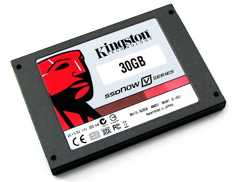
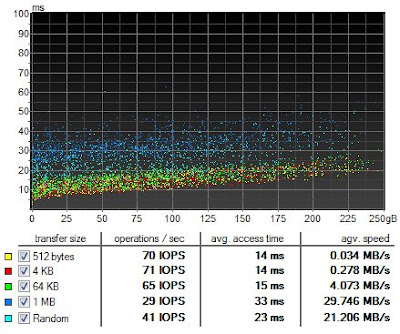
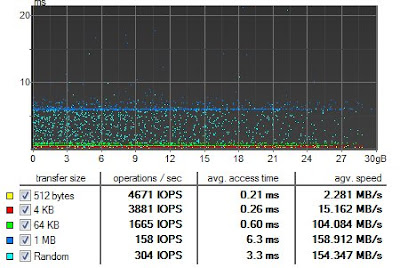
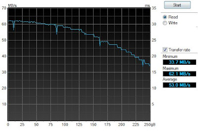
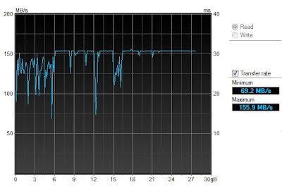

Here is a quick summary and review of my initial experience with a Kingston SSDNow 30GB SSD.  
  
This solid state drive cost me $69 CAD on sale, although it usually retails for about $100. As it stands, this is currently the least expensive solid state drive on the market that is suitable for use as a system boot drive. While faster and more spacious drives do exist, this drive offers exceptional value and is a great choice for those on a budget. Unlike some older value solid state drives, this Kingston 30GB SSD is a second generation drive that includes TRIM support. While TRIM support is a nice bonus if you have Windows 7 installed, for use as a system boot drive it shouldn't make a big difference.  
The drive came with no software or accessories - just the drive. The case is solid, but light, and doesn't feel like there is much inside. When installing Windows 7 to the drive, things went smoothly other than a small BIOS issue I had. Reseting the BIOS fixed the problem I was having, which was causing my computer to crash when the drive was accessed.  
As we will see below, both sequential and random read speeds on this drive far out pace those of a traditional hard drive. This drive does however lack decent write speeds, maxing out at about 50 MB/s, but the only time that might be bothered by this is during the Windows installation - a one time ordeal that takes under an hour. I won't bother to test write speeds today, partially because it's not an important feature of a boot drive, but also because it means formatting the drive again - I already installed Windows to it and don't want to do that again.  
After installing Windows 7 and a few basic applications, I was left with 15GB of free space, out of 27.9GB. I then changed the directory location of my *program files* to an old hard drive so that I wouldn't clutter up the SSD with non-important applications. You can make this change in the registry. I might be able to clear up a little more room on the SSD if I deleted a few default applications and moved the hibernation or page file somewhere else - possibly a good idea considering how slow the write speeds are, but I won't.  
The drive contains 30,014,435,328 bytes, or 30GB, after formating with NTFS. However, because Windows uses a different method of calculating memory, 1024 vs 1000, the drive is reported to only have 27.9GB of space. You are not being cheated, so don't worry.  
As for performance, my freshly formatted system starts up noticeably faster than when I was using a 250 GB hard drive. It isn't quite instant, and considering how this SSD is one of the slowest SSDs on the market, you can't expect mind blowing results. However, as we see below, sequential read speeds are three times the speed of a standard hard drive and the random read rates are worlds apart. Applications that are loaded onto the SSD feel even snappier when they open, leading to an improved user experience. Even if it's a cheap SSD, it blows an old hard drive out of the water.  
Laptop users who can only install one drive will not want this drive however, because 30GB is not enough space for everything you will need to store. The write speeds also suck. Netbook users might however be content with a bare system. Desktop users though will love this drive since they can load Windows onto it and load everything else onto large hard drives. For $69, you get great value and great performance. Welcome to the future.  
  
**Results**[Western Digital 250GB 7200RPM 3.5" hard drive - random read rates](http://4.bp.blogspot.com/_kfv2ADnjgQg/S8LfXNAfwrI/AAAAAAAAEy4/liSwFAoXCT4/s1600/4.jpg)  
  
  
[Kingston SSD 30GB - Random read rates](http://3.bp.blogspot.com/_kfv2ADnjgQg/S8LfW7bjcWI/AAAAAAAAEyw/o1VCJRhuO_g/s1600/3.jpg)  
  
  
Western Digital 250GB HDD - Sequential read rates  
  
  
  
Kingston 30GB SSD - Sequential read rates  
***Update, Day 3:***Well, it's not quite a deal breaker yet, but as you can tell from the above sequential read speeds of this Kingston SSD, there is a little bit of jitter. Sometimes this little bit of jitter is noticeable when browsing with Google Chrome or when recording high bit-rate video to the drive, as I'm seeing some dropped frames when I do. I guess I can install Google Chrome to a HDD and record to a HDD, but that's kinda lame. I still need to confirm if it is the SSD for sure, or whether there is some other problem. Anyways, you get what you pay for ultimately, but I'm still happy with my purchase. =) Cheers.  
