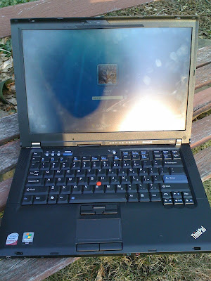

# Lenovo T400 - Trial Outdoors

*Author: Steve*
*Published on: 2009-03-18T17:39:00.000-04:00*

---

It has been a long winter up here in Canada and with the warm, sunny weather now approaching, computer users attempt to migrate outside with their laptops to soak up some much needed Vitamin D. One problem though -- not all notebooks displays are readable in bright light.  
  
I wanted to try out my Lenovo Thinkpad T400 notebook outside today, as the weather was finally somewhat warm and the sun was shining. I bought the T400 a few months ago in hopes of the screen being usable outside in direct sunlight, but I was unable to actually test it until now.  
  
When customizing a Thinkpad at Lenovo.com, there often are a few choices for display types. Some options include LED backlighting, some include high resolution displays and most recently, Lenovo has started offering an ultra bright 680-nit display option for the T400 that is designed for outdoor use it would seem.  
  
The display my Thinkpad uses is the LED-backit 1440 by 900 resolution display option, which is bright, but not 680-nit bright.  
  
  
I started my test outside with the T400 in the early afternoon on a sunny March day here in Toronto. One thing I quickly noticed was that in direct sunlight, reading black on white text was quite easy, even with the backlight turned off; this was in part due to the transflection properties of the display. Without the backlight on, the whites had a yellow tint to it, whereas with the backlight set to full, there was more of a slight blue tint to the whites. Also, shadows (with the backlight off) quickly lowered the contrast, making it harder to read, while with the backlight set to full, shadows had less of an effect.  
  
Despite having some added problems with having the backlight off, in direct sunlight text was still readable with the backlight off and I was able to greatly increase the battery life of the notebook because of it.  
  
On an overcast day, or when there are shadows present, turning on the backlight to full works well to bring out more accurate colors and to make text even more readable. Text was still not as easy to read as it is when indoors, but it was workable. I was able to write up an article for work, while sitting in the sun at a park with my iPhone providing me a tethered Internet connection. I will need to try this all on the beach sometime. :-)  
  
  
Anyways, as for reflections, since the screen was matted, I did not see any real reflections at all. (unlike on the new glossy Macbook displays). Other than reduced contrast, my eyes did not need to fight or become strained trying to see the display. There was one problem, easily fixed, but during the late afternoon, when the soon was nearing the horizon, there was a blurry bright reflection of the sun. Adjusting the screen's angle or shifting the notebook a bit to another angle fixed that issue.  
  
As a conclusion, I would say the matted LED backlit 1440x900 LCD display on the Lenovo T400 is fully adequate for working on a document outside in the direct sun. It even has some transflective properties that allow a user to turn off the backlight completely and still see the screen. Watching a dark movie or dealing with dim images may be troublesome however.  
  
The incredible battery life of the T400 allowed me to spend virtually the entire day working outside, which is a plus as well. Purchasing the new 600-nit option displays for the T400 would be even better for working outdoors I am sure. I'm very pleased, but as you can tell from the images, contrast is still greatly lowered.  
  
One last thing,  
I will try to add more photos of other notebooks under direct sunlight conditions to help give everyone an idea of what are good outdoor displays and what are not. If any readers have a photo of their notebook out in the sun however, send it my way and I will add it to the site, along with all the others I get.  
  
punkrawker@gmail.com  
  
  
[Update: A reader had a few questions for me that I may not of made clear in this article. So, I am attaching below my response, in case anyone else has similar questions. ]  
  
  
 When I bought my T400, Lenovo offered a different selection of LCD panels for the T400. There was the WXGA, WXGA+ and WXGA+ /w LED BL. I notice that Lenovo seems to change what is offered quite often; sometimes do to a shortage of a specific type. In some cases, it is just the price that goes up or down for an option, but at other times, the option is removed. I paid about $80 for my screen upgrade; while there were some weeks the same upgrade cost $150- it does not seem like Lenovo.com Canada offers this option at the moment.  
  
 The current offerings at Lenovo Canada are:  
 WXGA  
 WXGA+  
 WXGA HN + backlit.  
 (none of these really seem that great to me)  
  
  
 I bought the **WXGA+ /w LED BL.** From what I can tell, my display has a 300:1 contrast and 250 nits of brightness. It really seems quite bright compared to older Thinkpads.  
  
 This T400 review also had the same panel that I have it seems.  
 <http://www.buy.com/articles/loc/64230/channeltype/2/channelid/127/subtype/1/2004569.html>  
 There opinion on the 250nit display outdoors was "it is perfectly serviceable outside." I tend to agree; even on the sunniest of days, things are quite usable/readable. However, with the 250nit display, in direct sunlight the contrast of the screen seemed to be become lower, so I would say if you plan on working outdoors a lot, an even brighter screen could be a better choice. A brighter screen = easier to view outside. The pictures in my article are of the 250nit LED display in sunlight.  
  
The 250 nit display that my T400 has is currently not offered at this time at Lenovo.com Canada, but it might become available in the future. If you can get the WXGA+ /w LED BL 250nit display upgrade (for under $100, preferably), I'd say it is a great option for people who only occasionally plan to use their notebooks outdoors. It is still looks bright and more than bright enough for indoor use. The viewing angles are not that super great however.  
  
  
Their is currently a **WXGA HN (high nit?) /w LED BL** being offered now at Lenovo.com Canada --- I assume this is the 680 nit option as mentioned in this article. <http://www.eweek.com/c/a/Desktops-and-Notebooks/Lenovo-ThinkPad-Laptop-Toughens-Up-Against-Panasonic-Dell/>  
"The Lenovo ThinkPad T400, which has a retail price starting at $1,350, includes an optional 680-nit "high brightness" panel designed to provide extra visibility even in bright ambient conditions, such as light shining directly on the screen. "   
  
As for a higher resolution version of this display, someone on the Internet said "at least for one day, there was yet another option (priced at $150, if I recall correctly) for a 14.1" **WXGA+ (1440x900) "High Nit" with LED backlighting**." The HN high resolution LCD display might of sold out already. If you wait, it might become available again in the future. And then again, Maybe not. It seems like the best choice for a LCD Panel if you can get it.  
  
 Heavy outdoor users will want to grab the HN (680nit?) LED BL option, as it will make working outside more pleasurable. If you can get it with the WXGA+ resolution, that would probably be preferred. You might have to wait and see if it becomes available though. I can't really suggest anyone get the WXGA low-resolution display, but for a lot of people that resolution is fine to use. If that is the only option available, it might be the best choice though. If it were me, I'd wait and see what other options become available.  
  
  
 I have also seen a "**Wide Viewing Angle" display** option appear at Lenovo.com at one time or another; I dont know how it differs exactly from other screens, but the display I have does not have great viewing angles. It seems however that the HN display options have Wide viewing angles (which is great). " , Lenovo is equipping the ThinkPad T400 laptop with an optional high brightness, wide angle screen, making it nearly four times brighter than previous ThinkPad laptop screens." - Lenovo PR. Im unsure exactly if this is a fact yet tho and im not sure what exactly is considered wide angle.  
  
 As for the **Non-LED BL displays (CCFL)**, I would not recommend getting one of these. They tend to be not as bright as the LED BL displays, and these backlights often tend to burn out after like 5 years of use. The LED BL options also seem to provide for better battery life comparably.  
  
   
If it were me at the moment looking to buy a new T400, I would wait for better options to become available. I like having a high resolution display, but I also like my display being LED backlit. Since I don't work outside that much, the WXGA+ 250-nit LED BL option works fine for me, but a brighter screen with better viewing angles would be preferred. The WXGA+ HN /w LED BL option would probably be the best option, if you can find that offer.  
   
  
 I do not know for sure if you can buy a Thinkpad in the US and have the warranty be valid in Canada. According to this discussion however, <http://forum.notebookreview.com/showthread.php?t=90585>, a USA warranty is valid in Canada. If you can order from the US, it seems like that may indeed be a great way of getting the display type you want, while not having to wait for Lenovo Canada to start offering it.  
  
(At the time of this writing, Lenovo USA only offers CCFL displays and the WXGA HN LED display. The same as Canada, so ordering from the US at this time may not actualy help out much)  
  
(disclaimer: This article contains opinions and it may also contain factual errors. Please inform me of any errors, so I can correct them. If you do not agree with my opinion on something, please leave a comment below to share your own opinion. thank you.)