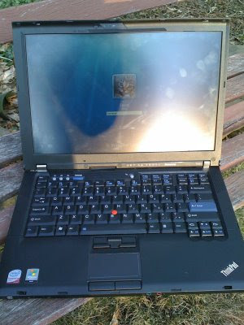

# Lenovo T400 Review

*Author: Steve*
*Published on: 2008-12-23T19:33:00.000-05:00*

---

  

So, let my review of the Lenovo T400 begin.

  
  
Configuration under review  
**Lenovo T400**14.1-inch LED 1440x900 display  
Intel Core 2 Duo P8600 CPU (2.4 GHz, 3 MB L2 Cache, 25 W TDP)  
3 GB of DDR3-1066 MHz RAM  
Switchable graphics: Intel GMA X4500MHD or ATI Mobility 3470 /w 256 MB  
Bluetooth  
Intel 5300 WiFi  
80 GB 5400 HDD  
Webcam  
Media Card Reader  
Windows Vista Home Basic  
9-cell extended battery  

Price: $1070 CAD (Ordered November 24th, Delivered December 4th)  
Also ordered a Lenovo Bluetooth laser mouse. Price: $33 (Delivered in 1.5 days)  
Prices were substaintially discounted, thanks to a friends of employees discount and an addition e-coupon code.  

**CPU Performance:**1M on SuperPI Mod 1.5 scored about 21 seconds.  
For comparison, my 3 year old AMD Sempron 3000+ overclocked to 2.4 GHz scored 50 seconds and my brother's 2 year old Intel Core 2 Duo E6300 overclocked to 3.0 GHz scored 19 seconds. The processor is very efficient in both terms of clock cycles and power savings, but compared to modern-day desktops, it is not particularly fast.  

**Graphics Performance;**Intel's integrated graphics solutions are not known for great performance, but they do tend to be energy-efficient. Using the integrated graphics on the T400 makes sense for nearly everything one might do on a notebook, including watching HD movies, but for games and graphically demanding applications, Intel's integrated solutions will be a let down. I am a bit concerned about the capabilities of the integrated solutions several years down the road, whether they will still be adequate, but for the forseeable future they are enough.  

Luckily, the T400 is also offered with a discrete graphics option; the ATI Radeon M 3470 with 256 MB of graphics memory. Better yet, when using Windows Vista, with literally just a couple clicks of the mouse you can switch between the integrated and ATI dedicated graphics. The ATI graphics do use more power, so to simply leave the notebook with dedicated graphics enabled is not the best choice for increasing battery life. The power managment software cannot switch between dedicated and integrated graphics on its own, you have to manually change it by clicking.  

The ATI Radeon M 3470 is about THREE times faster than the integrated solution. In 3DMark06, I was able to achieve a score of 2540, with the dedicated graphics, which is not a great score. My slow, old AMD Sempron 3000+ (overclocked) system for example, with a cheap Nvidia 8600 GT graphics card, was able to score 6000 points in the same test. Do not overestimate how fast the ATI 3470 is; it is not fast. The average score in 3DMark06 these days for a desktop is about 14,000. However, I was able to still play Fallout 3 on medium graphics without any problems and I was able to play my collection of older games just fine with the ATI solution.  

I still recommend getting the discrete graphics option if you are going to get the Lenovo T400; you don't need to enable it, but it is nice to have if the integrated solution ends up ever being simply too slow. It is not good enough for serious gaming, but you can get away with using it for casual gaming. The integrated solution is still fine if you plan on treating the T400 as a business notebook only.  

**Battery Life:**At 50-percent brightness (which is just fine for writing with), the wireless connections in Idle mode (not connected, but enabled) and integrated graphics enabled, I am getting about 10-hours of battery life. The configuration I picked of T400 was designed to offer me maximum battery life. With online gaming, I would expect about 3-hours of battery life (ATI graphics, speed step enabled, and 70-percent brightness). With web-surfing, I expect about 7- to 8-hours of battery life. With watching online movies, I would say no more than 5-hours can be expected. These are my estimations with about 3 weeks of using the T400 under my belt. Overall, battery life is great with the 9-cell battery, which does stick out the back of the notebook, but the trade off was well worth it too me. I was getting about 7-hours with my iPhone tethered via USB, in power save mode.  

**Display:**I personally find the viewing angles on the T400 a bit too narrow for my liking. It really throws off the contrast if the screen is not tilted at exactly the right angle. I have gotten use to it though, but during movies it can still be a bit annoying. Darker scenes seem to exaggerate the problem I find.

  
The display can be turned up to be rather bright, but it is no brighter than what you would find on a quality desktop LCD display. It is a big improvement over my older IBM Thinkpad though, but use in direct sunlight will still be a bit challenging. During an overcast day, at full brightness, the display was easily readable though. The contrast of the display needs a bit of tuning to get it just right, as I found the lighter shades got washed out. I'm glad the screen is matted and not glossy, but the display is still very prone to annoying finger prints.  
  
Btw, There seemed to be a bit of flicker at times; hardly noticable, but when the brightness was turned down I sometimes noticed it. When taking photos of the display with my camera, the flicker became very apparent. My CCFL-based Thinkpad had no such flicker. It seemed like something to do with LED backlighting.

[[update:](http://tomorrowtimes.blogspot.com/2009/03/lenovo-t400-trial-outdoors.html) I added a new review of the outdoor capabilities of the T400's LED display]  

**Hard Drive:**The 80 GB hard drive was split into 3 partitions, with nearly 15 GB being reserved for recovery and rescue software. After installing some basic applications, I discovered that I was already down to just 20 GB of free space. If you choose however, you can take out the DVD drive and replace it with a second hard drive, which I am tempted to do. I hardly use the DVD drive anyways. You can also replace it with a second battery, but from what I have read it seems they have a limited lifespan due to constantly being fully drained.  

The hard drive turned out to be Western Digital 'Blue' Scorpion drive, which appears to be fast for a 5400 RPM drive and rather energy efficient.  

**Recovery Software:**One of the paritions is reserved for a bootable recovery utility. It's like a live boot CD was pre-loaded on the drive. You can browse the internet, fix your computer and copy files off the hard drive if needed. Overall, I was impressed by the amount of recovery software included. I unfortunately don't have enough hard drive space to do any system backups, but there are several different options for that. There is also the ability to 'rejuvinate' your system by restoring to an earlier backup, but while keeping all your preferences and files. Supposedly, this is a good way to get rid of a virus or get rid of bloatware that has been slowing your system down.  

The ThinkVantage blue button on the keyboard opens a menu with short cuts to commonly used utlities and recovery options. A nice touch that I keep forgetting I have.  

One thing I discovered though is; don't mess around with the partition/boot tables. If the recovery partition cannot boot, you are going to have lots of problems. Another potential problem is if the hard drive dies. All the recovery software is on the drive, so it's useless if your hard drive crashes. Lenovo does not include a boot CD or recovery CD; something I found to be very frustrating. There is an option to 'create' a restore/recovery DVD, but you need the DVD burning option for that. I ordered the CD RW drive, not the DVD RW, so how was I going to create a recovery DVD? It ended up needing to burn 12 CDs, which was a waste of my time.  

If you need to reformat your drive, and you havent created the restore CD set, you are also going to face problems with finding all the drives and software online that originally came with your notebook. Lenovo will send you a recovery DVD if you beg them for one though, assuming you are still within warranty, but they may charge you money for it. I wish they just included the DVD with the purchase; it would make things much easier.  

**Bloatware:**Although there was a bit of bloatware included with the purchase, none of it was all that bad. Office 2007 demo, WinDVD, some AntiVirus software, and a ton of ThinkVantage programs. It didn't take long at all to delete the stuff I didnt want, which wasn't much, but I was still left with a lot of things in my task tray. Generally, the Thinkvantage tools and services take up very little memory and processing cycles, and other than a crowded taskbar, I'm happy. The 3 GB of memory helps make this an even smaller issue. Lenovo did a good job integrating its tools into the Windows Vista operating system, giving Windows Vista many more advanced options, especially in regard to power managment.  
  

**Sound:**The sound quality is crisp and clean, but it is lacking bass. Nothing that wasn't expected. The loudness though is a bit of a problem, as the volume does not go up that high. It has been fine so far for personal use, but some movies that I have watched I wish could have been just a bit louder. Wearing headphones works great.  

  
**Wireless:**I got the Intel 5300 wifi, which comes with three antennas instead of two. It seems to work great; picking up WiFi APs with no problem. I was able to download a CD image from a desktop computer on a network via WiFi 802.11G at about 2.2 MB/s (Linksys G router). Depending on power mode, sometimes the WiFi goes to sleep and it doesn't always come out of sleep when its needed. I have to manually re-enable it. There is a physical switch on the T400 to turn off all WiFi, which is nice.  

Bluetooth works. I had some problems getting my iPhone to sync at one point over Bluetooth, but eventually I got it to work. Dunno why I was having problems. The wireless Bluetooth Lenovo laser mouse has generally worked well. In games like fallout 3, I noticed some mouse lag, but with just websurfing, there was no lag at all. The mouse connects quickly, although I did have a couple times when the computer and mouse wouldnt sync properly, but after a few minutes of pressing buttons, it suddenly began acting fine again.  
  

**Webcam:**The camera is kinda junky. Im sorry to say. The camera is useless under dim lighting, but under moderate lighting it is acceptable. Under bright light, things begin to work a bit better however. 

  
(At the Mall, writing this. It is bright here, so the colors are actually pretty good. However, my head is cut in half and there is a mysterious [sarcasm] white dot appearing on my face)  
  
Lastly, the camera does not feel like it is aimed properly at my head. It points towards to the ceiling, rather than my head. This is in part due to the viewing angle the display needs to be tilted at to be seen properly. If the display had a better viewing angle, it might be possible to tilt the screen forward more and solve the webcam aiming issue. As it stands, the screen gets totally washed out when you tilt it forward. I have the same problem with the keyboard light next to the webcam ; it blinds you rather than illuminate the keyboard when the keyboard is tilted at its proper position. If you tilt the display forward, you no longer need the light, as the display's backlight illuminates the keyboard just fine.  
  
**Style and Quality:**

It is a Thinkpad. I think the bevels on the side of the keyboard and around the display could be slimmed down. As it stands, I feel it is an inch bigger than it needs to be to fit the keyboard and display. The notebook is boring, businessy, but it is pretty resistant to fingerprints and damage. The battery is a bit loose, which makes the notebook feel a bit cheap. There are not many weak spots on the notebook; the keyboard does feel solid, despite what other reviewers have said, and I can see this notebook lasting a long time. It is of standard weight and thickness; maybe just a tad thinner/lighter than your average 14-inch notebook, but it is no ultra-light. It is under 6 pounds.  

**Ports:**There are no DVI/HDMI/S-Video ports, just a VGA port. there are also three USB ports, a firewire port, ethernet, modem and a card slot for expansion i guess. The media card reader works fine, but compact cards do not work with it, but SD cards do.  

  
**Conclusion:**Overall, I am happy with this notebook. If you have used a ThinkPad before, there should not be too many surprises. The Lenovo T400 should be a fine notebook to use for work, but for gaming it may not be the best choice. I think a desktop would be the much better choice for gaming. However, the T400 is adequate for casual gaming. The T400 is also not an ultra light, but it does offers a good balance of weight and features I think. The battery life remains one of the highlights for me with this notebook, but if battery life is not that important to you, there definitly are some other options out there for you.

