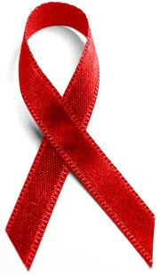

 Clinical studies of the drug, called an integrase inhibitor, showed that, when combined with two existing drugs, it reduced the virus to undetectable levels in nearly 100 percent of HIV patients prescribed a drug regimen for the first time, The Los Angeles Times said Tuesday.  
  
It had a similar effect in 72 percent of salvage therapy patients, who take a mixture of existing medications aimed at stalling the virus until new drugs appear. The drug essentially prevents the virus' DNA from integrating with a host's cells, inhibiting its ability to replicate itself.  
  
The U.S. Food and Drug Administration should approve it in mid-2007. Manufacturer Merck & Co. is making it available sooner to patients in desperate straits.  
[Source](http://www.physorg.com/news86960302.html)