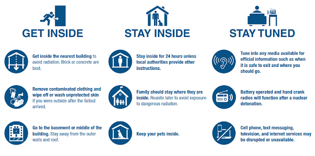
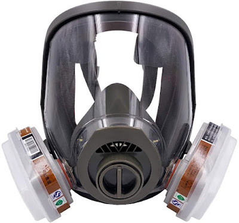

## In the case of nuclear war or a nuclear explosion/meltdown, there becomes a risk to your health, if not your life. We take for granted this time of peace, where nuclear threats are more of a trope than a real fear, but it's a significant threat in reality. People didn't consider a global pandemic as likely either, and then it happened.

  
  
An official guide by the US Government on [preparing for a nuclear incident can be found here.](https://www.ready.gov/sites/default/files/2020-11/ready_nuclear-explosion_fact-sheet_0.pdf)  
  
It covers some of the basics, such as know where your local shelters are, have an emergency supply kit,  bottled water to last at least three days, and a portable radio. Preferably, have such emergency kits at all the places you commonly frequent, such as work, home, it might not hurt to have some items in your car's trunk.  
  
In the case of an nuclear emergency however, get inside before any fallout arrives, and if late getting inside, be sure to discard your outer clothing layers and wash yourself and any pets down. It is safe to drink or eat sealed products that were not outside, but other things may be dangerously contaminated at this point.  
  
Radiation levels outside could be quite high during the first few days, so avoid going outside, and ideally move to the center of your building, preferably in a basement. Radiation levels drop exponentially, so after a couple weeks most the danger of radiation will begin to pass.  
For most people, these guidelines are sensible for a mass population, but for those wishing to take some extra precautions, read on.### potassium iodine

Having at least a few potassium iodine pills, along with directions on how to use them, may add years to your life in the case of a nuclear incident. If living within 100-km of a major city, military base, or nuclear power station, it's almost a no brainer that you should have them in case of need. Potassium iodine helps prevent some forms of nuclear fallout from getting stuck in your body if taken in time.  
  
Nuclear fallout may start coming down after just 10-minutes of an incident, and a day of exposure could leave your thyroid glands saturated in dangerous radioiodine. How likely is it that the government will be able to distribute potassium iodine pills to the public in such a short amount of time? Does your neighbourhood have a stocked nuclear shelter? Even if you could run out to get them, you shouldn't be going outdoors to pick them up if already hiding in your basement. If you unexpectedly need them, it will likely be just too late.  
Considering that you need to take about one pill per day, per person, and your exposure to fallout may last days or even weeks. You may even want to grab extras while at it; help protect yourself, your family, and those in your immediate vicinity. These pills don't cost a lot currently, but they will be priceless when they are needed. If living or working near a nuclear power station, they may actually be free for you; call up and ask.  
As many of us work outside our homes, having potassium iodine pills at your workplace, along with bottled water, may be just as important as having them at home. You never know where you might get stuck, so having emergency stashes at all the places you common frequent, such as perhaps within your car, is common sense.### masks and respirators

I won't go into in-depth comparisons of different masks and respirators, as the filters of the masks are what matters the most.  
While serious preppers may go all out with military gear, the average consumer might be fairly protected with a box of real N95 mask that they already have around. There are plenty of fake N95 masks out there, although 3M offers disposable N95 masks with an authenticity check for peace of mind.  
Next up, from your diehard ANTIFA protestor to DIY home renovator, 3M half-masks will be quite familiar things and are a step up from paper N95 masks. There's many types of filters sold for these respirators, although a 3M P100 filter is probably sufficient and can be bought with a 3M half mask for $25 to $50 USD. Half masks aren't quite as disposable as N95 paper masks are, so spend time researching how to clean them; the filters themselves should still be replaced after use.  
  
Remember, radiation lingers for weeks and certain kinds can last decades, unlike germs that may die within hours or days.   
  
Eye protection may be a consideration as well, so with a half mask sealed goggles with dust-resistance may be a nice to have as well.  If going with a full-mask however, you'll get eye protection included, and may find a full-mask more comfortable for extended use. 3M also makes some great full-masks at a range of prices.  
3M's full-face masks are normally Z87.1 certified, meaning they can withstand impacts without shattering. If you get a knock-off 3M mask, you'll have just a plastic face shield that can crack easily and leave your eyes at greater risk to things like rubber bullets. In terms of protection though, if you can get a good seal, even a budget full-face mask is likely better than nothing, and may still provide good-enough protection for your needs. Cheap chinese masks do often break easily though, so still not advisable.  
  
Regardless of mask type, be sure to learn how to put your mask on, how to get a good fit, and then make sure to test that you have a good air-tight seal.  You have the time to shop around for a mask that fits you well, is comfortable for extended use, won't break when you need it.  
  
Having a simple mask in your office workplace and in the back of your car might not hurt either; these can also come in handy for dealing with smoke.  
  
### filters for respirators

The 3M 60928 cartridge filter contains TEDA and has a 99.98% @ 0.3um particulates filtering ability. It was designed specifically for radioiodine protection, as the carbon filters in it was impregnated with TEDA and that can absorb radioiodine. It's rated for about 8-hours of industrial grade protection, so if you need to leave your home or need to get home after a nuclear explosion, this filter may help prevent radioiodine from getting into your body. It can also protect against radioactive dust, smoke, and probably even exposure to a little bit of tear gas.  
3M makes their consumer-grade masks especially hard to get good information on, but from everything I've read, they offer exceptional performance and value, even better than MIRA filters in some scenarios.   
  
For example, the consumer 3M P100 filter out performs a MIRA P100 military-style filter, but costs a fraction. <https://www.youtube.com/watch?v=ElSsBtkzKXk>  Be wary of the Chinese knock-offs however; a MIRA P100 filter might offer 99.95% protection, and a 3M P100 might be 99.97%, but the knock-offs have been tested to offer just ~70% protection, despite looking near identical.  
You can find in the following links how the consumer 3M filters compare to the more expensive 3M filters:  
<https://multimedia.3m.com/mws/media/1590338O/selection-guide-poster.pdf>  
<https://multimedia.3m.com/mws/media/1808826O/3m-scott-av-632-bayonet-adapter-conversion-guide.pdf>  
While there is no 3M consumer filter rated to officially offer protection from tear gas, the 60926, 60923, and 60921 have been battle tested by protestors as effective. The 6001, 6003, and 6006 also would likely work well, but when combined with a 3M P100 filter (using a 3M 502 adapter), they would be effective against smoke as well. Quite a few other 3M filters mention specific organic vapours capabilities, like the 60928, but the 60926 is designed to be the most universal and is often the most recommended for WSHTF scenarios.  
  
A knock-off 3M 502 adapter can be ordered from China for pretty cheap, and doing so might save you some money in the long run. A 3M 6006 filter is the same as the 3M 60926, but without the integrated P100 filter. With the 502-adapter, you can add your own P100 filter to a 6000-series cartridge filter; makes it easier to replace just the P100 filter if needed. A 6006 cartridge + P100 filter is a bit cheaper than a 60926 I find.  
  
I don't know how a P100 filter performs with radiation vs the radiation-specific 60928 filter, but given how there is no version of the 60928 without a P100 filter built in, I presume the P100 filtering is a pretty important part of the radiation protection that the 60928 offers. Consider that, even standard N95 masks used during COVID will be far better than nothing when it comes to protecting against radioactive dust and particulates. We all know now the value of a box of N95 masks, so don't throw them out, at the very least.  
Have more than one mask/filter, as you'll want to change your filters/masks regularly; you don't want to be bring radioactive dust into your safe space after venturing outside. If needed, be sure to shave your face, and also consider shaving your head bald. Facial hair can prevent a face mask from getting a proper air-tight seal, and radiation likes to cling to hair.  
Avoid moisturizers, conditioners, hair product, and clothing that clings. If exposed to radiation, wash yourself with soap and consider shaving off your hair.  
Also bag your shoes if going out and tape-seal where needed; you will be walking in radioactive dust after all and you will likely need your shoes again.  
I bought some XL disposable 3M antistatic hooded hazmat suits, a box of 25, although just not going outside is probably the safest option. If coming indoors though, dispose of you outer protective layers; bag them and leave them outdoors. If unprepared and needing to go out, a hooded jacket or disposable hooded poncho may be protective outerwear options.### counterfeits and knock-offs

I wish it wasn't the case, but China exports many very dangerous counterfeit and imitation 3M personal protection products. Despite the appealing low price of some of them, the reality is, they pale in comparison to the actual 3M product. We're talking about basic micron-sized dust filters that end up having 100x less protection than the real thing, despite looking identical and claiming to be identical. Seriously, 100x less protection.  
While other Chinese filters might also claim to offer organic vapour protection, they leak activated carbon when shaken and when opened up, you'll see low-quality activated carbon with an unknown expiry date. There's a science to these filters that goes beyond just putting carbon in a box, and while some Chinese filters offer enough protection for painting some walls in your home, you still simply can't validate or trust what you're getting.  
Amazon product listings often cannot be trusted either, so if needing to buy from Amazon, find an Amazon product link from the 3M website itself. As for Aliexpress, I've spent time looking for real 3M filters there, and the only real ones I've found were actually more expensive than the ones on Amazon. All \*ALL\* the Aliexpress 3M filters that are a good deal are going to be fake. Don't give them a chance to fool you; the odds are stacked against you, especially if the price seems good.  
  
One tip to note about the Aliexpress counterfeits is that the use photos of the real-product in their product description. What you get however will look ever so slightly different, and be fake. Some users will post photos in the product review section, often with 5/5 stars believing they got a good deal, but a trained eye can see that their product is fake. It's exceptionally hard to tell in most cases, especially if limited to just a few blurry photos, but no worries - it's very safe to just assume that if buying from Aliexpress, it is fake and you're getting what you pay for - cheap crap.  
  
Now, while an imitation 3M mask isn't going to be as good as a real 3M mask, with poor quality control and with inferior materials, they are very affordable. I personally wouldn't use the included filters for much more than occasional light wood working, but if you're able to get an air-tight seal from the mask, that might be still sufficient. You might not need an impact-resistant lens, for example, and they will still accept and work with official 3M filters. My main concern is that the materials are cheap, and so the straps could break or the lens could crack within no time; not something you want to have happen during an emergency.  
  
  
  
  
  
  
  
  
  
  
  
  
  
  
  
  
  
  
  
