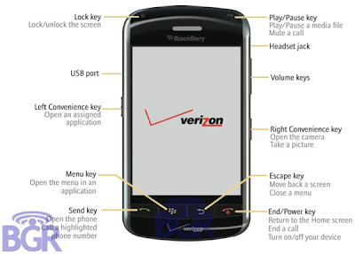

# RIM makes some Thunder of it's own

*Author: Steve*
*Published on: 2008-06-10T10:34:00.000-04:00*

---

  
Despite the iPhone 3G being the talk of the town these last few days, a device that has gone under the radar in a lots of ways may be just the thing to steal some of Apple's thunder. Introducing the RIM Blackberry Thunder (9500?).  
  
I gotta admit, it does look like the iPhone a lot, minus the buttons at the bottom. So now I have three choices for next gen phone; iPhone, Bold, and Thunder.   
I'm really liking the Thunder though. [Maybe I can get it without a contract?](http://feeds.gawker.com/~r/gizmodo/full/~3/308728815/att-memo-to-retail-managers-shows-iphone-3g-policy)