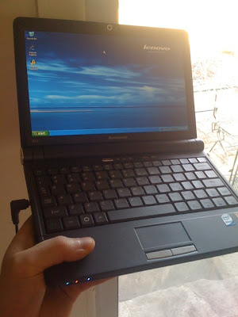
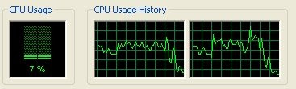
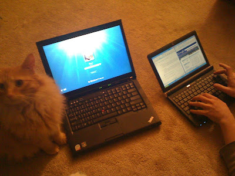

Here is my initial review of the Lenovo IdeaPad S10 netbook\* that I recently bought and had the day to play around with.  
  
System Specifications:  
10-inch display (matte)  
512 MB RAM (2 GB Max?)  
80 GB HDD  
Intel Atom 270 1.6 GHz processor.  
Intel GMA 950 graphics  
Webcam  
SD Card Reader  
3-cell battery  
Black  
Windows XP Home SP3  
  
Price paid: $329 (CAD) + tax & shipping  
I ordered the S10 from [NCIX Canada](http://ncix.com/products/index.php?sku=34117&vpn=59-015864&manufacture=Lenovo) on sale; Lenovo Canada charges $429 ($399 on sale) for a slightly more upgraded S10e model. I'm definitely happy with the price that I paid, but a 6-cell version would have been preferred.  
  
Performance:  
  
Futuremark's Peacekeeper Browser Benchmark:  
Internet Explorer 7.0 score = 64  
(for comparison, an AMD Athlon 64 3800+ scored 162 and an Intel Core 2 Duo E8400 scored 447)  
  
It made some sense to test the browser performance of the S10. A score of 64 is pretty low, but surfing the net still seemed to be responsive... most of the time. There were a few webpages, including Engadget, that seemed to cause a few seconds of unresponsiveness to the system as a whole while the page loaded. Switching to a faster browser, increasing the amount of memory from 512 MB to 2 GB (the max?) and installing anti-advertisement software to fend off the flash-based ads should help things out.  
  
SuperPi 1.5 Mod (http://www.xtremesystems.com/pi/)  
1 M = 1 minute, 34 seconds  
(for comparison, a Lenovo Thinkpad T400 with an Intel Core 2 Duo P8600 2.4 GHz scored 20 seconds)  
  
YouTube HD Video Playback  
I loaded up a YouTube HD video clip of the new Transformers 2 trailer (720p) for a test; playback was set to fullscreen and quality was set to high. The display of the S10 is not actually 720p, rather 1024 x 600.  
  
The Intel Atom 270 processor is not actually a dual-core chip, but rather it just has hyper-threading capabilities that make it seem like it is a dual-core. As you can see from the CPU Usage History though, at no point was the video putting a full strain on the system, but it got close at times. As it stands, low-bit rate 720p video should run just fine on the S10.  
  
Considering how the S10 has no Blu-ray drive, no DVI or HDMI output, and that it has a limited screen resolution, being able to handle 1080p video is not something most users will need to worry about with this system.  
  
Windows XP Startup  
I didn't bother to time it, but bootup speed with the 80 GB 5400 RPM hard drive seemed quick. There was very little useless bloatware pre-loaded on the system, but a Norton AV Trial was pre-installed, which I didn't care much for. I uninstalled it and Windows booted up a tad faster afterwards. Windows XP does still feel faster than Vista.  
  
System Build Quality and Design  
I was very pleased with the system quality of the Lenovo S10. It felt very solid, even more solid than the Lenovo Thinkpad T400 that I use regularly. My T400 actually felt a bit flimsy in comparison, but the S10 was kinda heavy too... it felt \*solid\*.  
  
The S10 was also a very attractive looking netbook in my opinion; classy, yet business looking. The black color worked well and although black is kinda boring, the small size of the system kept it still looking quite interesting  
  
(A cat, a Lenovo T400 and the Lenovo S10)  
  
As expected, the keyboard did feel kinda small, but it was fine for writing short emails with. I would not want to write a long article with it; I actually quickly gave up on writing this article on it. The keys were large enough to hit properly, but there was very little spacing in between the keys. I'm sure if you spent some time learning how to type on it, it would become easy to use. The fact I switch between so many computers here though, it is annoying to have to re-adjust to a new style of keyboard every time.  
  
[Update:] Compared to other netbooks, the S10 has a relatively spacious keyboard I'd say. After using it a bit more, I'm finding it easier to write on, but it still feels somewhat cramped and I'm still making more mistakes with it than on a normal size keyboard. I do have large hands though.  
  
It seems a bit pointless to hook up a dedicated USB keyboard to the S10, as why would you then not just bring a full size notebook with you or just use a desktop PC instead, but a dedicated keyboard would make typing on the system a lot better.  
(I'd take a notebook over a netbook or desktop if I could only have one, but casual users may prefer a netbook, so having a USB keyboard could still be sensible I guess)  
  
I felt that the right shift key was in an odd place, and that the tab button was a bit small, but considering the size of the keyboard it all made sense, so it didn't bother me much. Also, the Home, End and F12 keys are function keys.  
  
The touchpad was small, but it was fine to use- not really any more annoying to use than a regular notebook touchpad. There was a scrolling area along the side, which I was glad to have.  
  
The left and right buttons were firm and recessed (flush until pressed), which made them a bit hard to click actually, but for short-term use it was not annoying. I would want a mouse with me if I was going to be doing any serious work on the system. [Update: After a while, I got more accustomed to the buttons; they do not seem so annoying anymore to me.]  
  
I wish there was a Trackpoint nub also, but I figure that would of made the keyboard smaller and even harder to type on. Those red nubs surprisingly take up a lot of keyboard space  
  
The display, when shut, did not have any latch holding it locked in place. Instead, the hinge was firm, which kept the display in place. It was actually a bit tricky to open the notebook, considering the force it took and the lack of grip provided. When opened, the display opened up to about the same angle as a Macbook, which is a perfect angle for typical use. Still, if you want to use the S10 on a desk stand or something, this limited angle could be a problem.  
  
The display itself is matted and had decent viewing angles; not quite 178-degrees or anything, but it was better than some TN displays that I've used lately. I could vary my viewing angle from the ideal position somewhat without seeing much noticeable contrast difference; there was some though; mostly with the vertical.  
  
The max brightness level was good, more than enough for easy indoor use, and I would imagine it would be okay to use in the shade outside. In direct sunlight, well, its readable I'm betting, but I wouldn't recommend it. A bright screen was easier to read with.  
  
The size of the 10-inch screen was as expected; what size you decide on is really personal preference. The point of a netbook is to have something small and cheap, but having too small a netbook could also result in having an unusably small keyboard. The bevel around the screen and keyboard was relatively thin I felt, so that's good.  
  
Thanks to the decent resolution of the display, 1024 by 600, webpages did not feel too crap. There were some programs that could have used more vertical space, such as in Google Documents, but it wasn't too bad. I quickly got use to the screen size and found it didn't feel too small for most things. It might depend on your eye-sight though I guess.  
  
The colors and clarity of the display were all acceptable to me; no serious complaints about the screen here.  
  
The Webcam worked fine and the aim was pretty decent. It was relatively crisp and with moderately lit indoor lighting things seemed well exposed. The webcam really made me look even uglier than normal though; from how it appeared it was because the webcam was angled up at my face due to it being on my lap, rather than being at eye level, and because it brought out my pale skin colors too accurately. Who knows for sure though; maybe I'm just that ugly. For obvious reasons, I don't feel like including a snapshot, but regardless, the webcam itself seemed to be without any real fault. Nothing spectacular about it I guess, but it was better than some others that I have used.  
  
Update: I did notice that there was some lag delay in the webcam video feed and that the frame rate was not super amazing, especially when using the webcam in low light conditions, but that is pretty normal for webcams. Still, I'm pleased with the webcam.  
  
Update 2: Okay. okay. I've included a still from the default webcam feed. This was taken late at night with a couple lamps lighting the room. The room had low to moderate lighting. The image is unaltered; there is some strong noise removal present it seems.  
  
(Webcam still)  
  
The S10 does have an integrated microphone and speakers; I didn't test the microphone, but the speakers were as expected. Listening to my online voice mail, with the volume set to full, things came through fine. Not exactly full of bass, but they should be fine for basic use. Loud enough I'd say. You might want to carry a pair of headphones with you if you plan on listening to music or watching a movie.  
  
The S10 included a few other nifty design features, such as a dedicated button for launching the system's recovery tools and a button that turns off the wireless connectivity. There was also an expansion slot, which is unique among netbooks, but most users will never realize a use for it. There was only 2 USB ports though, instead of the typical three; one of each side of the netbook. Overall, I was pleased with the design of the S10 and all the design features it offers.  
  
Battery Life  
The S10 comes loaded with a simple\*\* power management tool. Not quite as fully featured as the versions on Thinkpads, but it worked well regardless. It lets a user quickly switch between performance, balanced, and power saving modes.  
  
On balanced mode, the screen's brightness was near fully brightness, which was great, and the system seemed speedy still. Battery life seemed to last about 3 hours (some are saying a bit less) of typical use, but it varies of course depending on what you are doing.  
  
On power savings mode, the audio, wireless and brightness level became disabled or reduced. Really, the power saving mode was unusable for me. It definitely would increase battery life if you were focused on just writing a document though.  
  
[\*\*Update: The power management tool actually turns out to be pretty powerful on the S10. It was not a very intuitive process, but to gain access to the real "advanced" power options, you need to double click one of the power scheme buttons in the Lenovo Power management application. The Lenovo PM software disables the Windows power management manager, which is fine with me, but can also be frustrating if you don't know how to access to the advanced options.]  
  
When the power got low, the system dimmed the display to save power it seemed. Problem is, when I plugged in the power cord after this happened, the display still remained dim; no biggie. The battery charged up to 90% very quickly.  
  
Software  
As for included software, there was no backup CD included, unsurprisingly, but there was a backup image of the Windows installation on a hidden partition. There were actually 3 partitions on the 80 GB drive, two of which were dedicated for system backups and drivers.  
  
In total, about half of the 80 GB drive was taken up by the backup partitions it appears, leaving less than 30 GB of free space on the main system C: partition. There was a lot of free space on the backup drive D: partition; no idea why though; it seemed to contain just some drivers and some backup files.  
  
You could format the entire 80 GB drive, but the default install was actually rather clean I thought and without a CD drive, reinstalling Windows could possible be a big pain. I would need to try to be sure though. You might get away with just deleting the D: partition for more free space; but I dont know how important the D: drive is yet.  
  
Ive been asked about this partition thing a lot, so I will double check the numbers I posted and report back when I figure it all out for sure. I don't think I am mistaken, but just to be sure, Check out [this review](http://www.liliputing.com/2008/09/first-look-at-the-lenovo-ideapad-s10.html); they are equally confused by the partition on the S10.  
  
[Update: Hidden partition = ~3.5GB of 15GB used, NTFS ; Drive C = ~7 GB of 30 GB used, FAT32 ; Drive D = ~1 GB of 30 GB used, NTFS]  
  
There was not a lot of other software pre-loaded on the S10; just some trial antivirus software, drivers and associated basic apps, and some Lenovo backup/restoration software.  
  
Conclusion  
I have not yet got a full feeling for the Lenovo S10, but my first impression from the device is a good one. If you are looking for a small, solid notebook that is capable of basic tasks, the S10 is a great choice.  
  
The three things I liked about the S10 the most included;  
-System failures can quickly be repaired thanks to the hidden system partitions and dedicated recovery button.  
-The included expansion card slot  
-The solid design that I have come to expect from Lenovo  
  
Three things I didn't like;  
-The trackpad buttons were fully recessed, making them harder to click with my fat thumb than normal.  
-The fact that the backup partitions took up nearly 40 GB of hard drive space.  
-I can't really fault Lenovo for this, as there is a 6-cell option available apparently, but the 3-cell battery can't offer a full day of mobile unwired use.  
  
  
Disclaimer: This article, along with others on this site, may contain opinions and/or factual claims that may be unintentionally wrong. I'm not perfect, but I try to be. \*I don't know if the term netbook is [legit to use](http://www.tomshardware.com/news/Netbook-Psion-Intel-Trademark,7138.html) these days anymore, but until the situation is clarified, I assume it is still fair use.  
