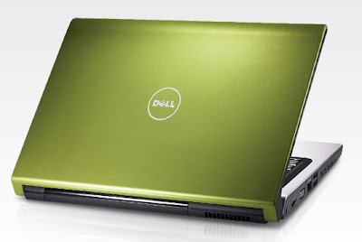
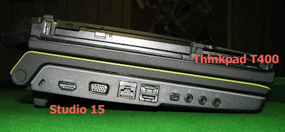
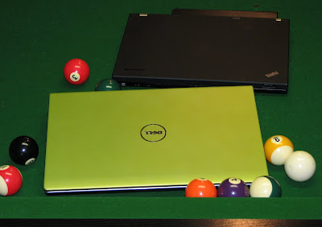

  
Hi everyone, welcome to my review of the new Dell Studio 15 (1555) notebook. I have had the notebook in my possession for just a few days as of this writing, so the review at this time will focus mostly on my first impressions of the device. I will update this article as I gain more experience using this system, so check back soon for added information or send me your questions [via email](mailto:punkrawker@gmail.com) for a prompt reply.  
  
The system under review has the following specifications:  
* |  |  |
| --- | --- |
| Processors | Intel® Core™ 2 Duo P8600 (2.4GHz/1066Mhz FSB/3MB cache) |
| Memory | 4GB Shared Dual Channel DDR2 at 800MHz |
| Keyboard | Back-lit Keyboard |
| LCD Panel | 15.6” High Definition (720p) LED Display with TrueLife™ and Camera |
| Video Card | 256MB ATI Mobility Radeon HD 4570 |
| Hard Drive | Size: 250GB SATA Hard Drive (5400RPM) |
| System Color | Spring Green |
| Operating System | Genuine Windows Vista® Home Premium Edition, 64-bit SP1 |
| Adobe | Adobe® Acrobat® Reader 9, English/French/Spanish |
| Combo or DVD+RW Drive | 8X Slot Load Super Multi (DL DVD+/-R Drive + RAM support) |
| Sound | High Definition Audio 2.0 |
| Wireless | Intel® High Performance Wireless-N Card |
| Office Productivity Software | Microsoft® Works 9 |
| Software - Antivirus | No Security |
| Battery | 85 WHr Lithium Ion Battery (9 cell) |
| Hardware Support Services | 1 Year Limited Warranty w/1 Year Return To Depot Service |
| Processor Labels | Intel® Core™ 2 Duo Processor |
| Misc 5 | No Internet Service Provider requested |
| Dell Remote Access | Dell Remote Access, free basic service |

  
According to my home cooking scale, the notebook weighed in at 6.2-pounds, which included the 9-cell battery. According to the Dell website, the new Studio 15 can weigh as little as 5.54-pounds, but that's only possible if it's equipped instead with the 6-cell battery and integrated graphics option. For comparison, the Lenovo Thinkpad T400 with 9-cell battery and dedicated graphics option weighs in at roughly 5.7-pounds; but the T400 is a 14-inch notebook, not at 15-inch.  
  
  
The dimensions of the Studio 15 are 14.6-inches by 10.0-inches by 1.0- to 1.5-inches (with 6-cell battery option). Since the front of the notebook is a bit thinner than the back of the notebook, the notebook has an appealing wedge shape that also gives the keyboard a slight upwards angle. The 9-cell battery option further increases this angle it seems, as the battery juts out from the rear-underside of the notebook. If you are concerned that the 9-cell battery option may look uglier than the 6-cell battery option, don't worry, it doesn't look that bad and it even adds a bit of functionality; the notebook gets better airflow and the raised angle of the keyboard might appeal to some users.  
  
  
Ordering the Notebook  
The notebook was ordered from the Dell Canada website on July 24th, it shipped for free from the USA a couple days later and it was delievered to me in Canada on July 28th by Puralator. Overall, I was pleased by the ordering process and the overall ease from ordering from Dell. The initial expected shipping date for my order was 3-weeks, so it was nice to have the notebook show up at my door in just a few days instead of a few weeks.  
  
The system was easy to configure with Dell's website and although upgrading from the base-specifications was a bit costly, the few upgrades I did select were worth the cost to me. Upgrade options such as a larger hard drive and added RAM may be cheaper to do yourself, however.  
  
I selected an Intel P-series processor over a T-series one, as the P-series is more energy-efficient than the latter. (25 W TDP vs 35 W TDP) The added energy-efficiency gives the notebook a bit more battery life, while also reducing heat.  
  
  
As for the notebook's colour, I picked "spring green", as this notebook was actually intended for my mother to use. One of the main reasons I went with the Dell Studio 15 was actually because of the colour and design options available; I wanted to make my mom feel like the notebook was actually built just for her. I would of preferred a 14-inch version of the notebook instead for her, but they don't yet exist; 15-inch notebooks just feel a bit too big to me.  
  
The notebook, as specified, cost $1,221 CAD before tax, which included a $100 savings. Dell always seems be offering some sort of special deal on its notebooks and overall the prices are usually fair.  
  
Design and Features  
ie:  
-ports (HDMI, 3 USB ports, Dual headphone jacks, SD card slot, Expresscard slot, etc)  
-screen (glossy, fairly bright, decent viewing angles for a notebook, 15.6" 16:9 LED screen, 1368x768 resolution is great as text is easy to read and things still look sharp.)  
-keyboard (some keyboard flex, backlight option is fabulous, pausekey is missing, decent typing experience, function keys are actually made to be useful, dedicated ejection button on keyboard for slot drive dvd)  
-trackpad is okay. its large enough, feels nice i guess  
-webcam works okay.  
-sound is a bit tinny, not wonderful for music, but its fine for youtube videos. loud enough.  
  
\* ... work in progress. Please come back soon! \*   
  
Performance  
ie:  
-battery life (6-hours at Idle, with power settings set to "Dell Recommended", experimenting still)  
-SuperPi (1M = 21.8 seconds. Same CPU as my T400, yet the T400 scored a flat 21 seconds. Probably due to the fact that the T400 uses DDR3 RAM, instead of DDR2.)  
-3DMark06=3731, 3DMark Vantage=P1155 (64 bit operationg system)  
  
\* ... work in progress. Please come back soon! \*  
  
Competition (PC and Mac)  
ie:  
-offers similiar/more features than a Mac, at a lower price. Windows vs MacOS. Comes with Windows 7 free upgrade coupon.  
-vs Thinkpads, HP, etc. (no switchable graphics, no thinkpoint, no matte screen, etc)  
-whats different in the new Studio 15 versus the old one.  
  
\* ... work in progress. Please come back soon! \* 