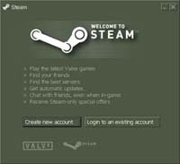

# The Highlight Awards

*Author: Steve*
*Published on: 2008-01-02T23:37:00.000-05:00*

---

  
Every now and then I come across products, services, ideas, or people that really stand out amongst the crowd in ways of innovation and quality. So with this new year I want to start giving out awards to these such things. I call these awards, Highlight Awards.  
  
  
To start, I'd like to give the first such Highlight Award to **Steam and Valve.** In the past they were responsible for making games like Counterstrike a reality. More recently, they have brought forth an online gaming user interface that is a step above others I've used in the past, such as GameSpy. But more than just allowing you to organize and manage your games, it brings forth the ability to download new games on-demand at high speeds, in the easiest of manners. To top it off, the cost of these games are very reasonable, and if you purchase one of the game packs, such as the now infamous Orange Box, you will get truly outstanding value. Not only are the prices great, but the games are top notch. ie: Bioshock, Portal, and Team Fortress 2 - All deserving their own highlight award.  
  
Never needing to deal with optical discs or CD-Keys again, great service, and undeniably exceptional products at value, Steam and Valve are companies that are leaders in the gaming market. They get the Highlight Award for bringing me back to actually wanting to buy my games insteading of pirating them.