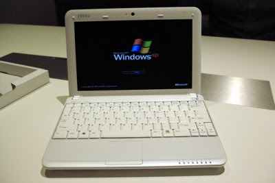

  
Ever since Asus introduced the EeePC, the ultra cheap, ultra portable, ultra light laptop, things in the laptop industry have found themselves entering new territory.  
People want a cheap laptop, that is truly mobile, and does the simple tasks they want. They may have a more powerful laptop at home, but most often, we just need something to keep us connected. Where smartphones start to lack, the Asus EeePC picks up, and with the need for connectivity these days, these cheap mobile secondary laptops are making a huge hit!  
  
Following the wave of Asus, there have been a flood of EeePC Clones. Even Asus has rushed to get its next model of the EeePC out on market, in an attempt to improve on its own design. They aren't the only ones though --- MSI's Wind laptop is hot on the heels of Asus with a design that seems to be an EeePC killer.  
  
Expected the second week of June, with a better screen, better keyboard, faster CPU, and more memory -- at still dirt cheap pricing, this is going to be the laptop you'll want to grab quick when on the go.  
  
The CPU is an Intel Atom 1.6GHz, but it runs at an underclocked 1.33GHz (rumors). Still, this is quite a bit faster than the original Asus EeePC, though slower than the 900MHz Celeron versions. More interesting, with the press of a button, you can force the CPU to run at 1.6GHz, the CPU's rated speed, or push the same button when on the go to further reduce power, letting you squeeze more vital battery life from the device when the speed is unneeded. It's great to see the Turbo Button making a comeback (finally) these last few months.  
  
Expect 3 to 7 hours of battery life, and a price around $500 to $600 on release.  
  
edit: There are some companies coming out with tablet versions of similar cheap UMPC that should shake up the market even more later this year. Expect in the next two years to see touch screens on laptops become an increasingly popular option, especially with the unreleased Windows 7 apparently designed with touchscreens in mind and Apple pushing them too.  
  
[More Details Here](http://www.engadget.com/2008/05/21/msi-wind-pc-benchmarked-secrets-of-the-atom-cracked/)