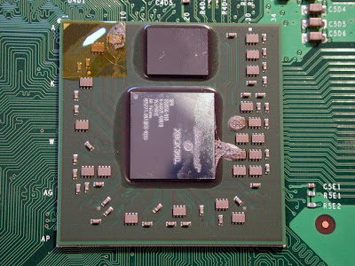

  
In a computer, we have the Central Processing Unit (CPU) and a Graphics Processing Unit (GPU). The CPU has traditionally been considered the heart of a computer, as it is responsible for running your software's code. The GPU on the other hand has traditionally been used to output to the computer screen what the CPU says to display.  
  
Overtime though, these devices, especially the GPU, have taken on more responsibilities in a computer. For example, the GPU for the last decade have been able to hardware accelerate 3D graphics -- something that was once done rather relatively poorly by software via the CPU instead. More recently, with high definition video being played on computers more and more, and the CPU struggling to process all that media data, GPUs were given the ability to take some of the processing responsibly, and speed up high definition playback on slower computers.   
  
Slowly it seems, GPUs are taking on more roles that used to be roles of the CPU. However, the need for more and more powerful GPUs is unnecessary for many, as even the simplest GPU today can do all but the most demanding tasks. So other than computer gamers [and CAD work], why would anyone need a powerful GPU?  
  
CPUs at this point in time really haven't crossed much into GPU territory, but that has also been due to the nature of the CPU's structure. They aren't designed to be able to parallel process huge amounts of data like GPUs do. However, that is all changing! CPUs in the last year have become multi-cored, meaning they are becoming more and more parallel with their processing nature-- they are becoming more like GPUs!   
  
Within the next year, we will be seeing CPUs that also work as GPUs (or intergrate one at least)! CPUs have become more than powerful enough to do the work of a GPU, and with CPUs expecting to grow to 80 cores in size in the next decade, they have all the parallel processing power to be a rather decent GPU solution-- even for computer gamers. This is especially true for those who don't plan on playing games, as the power needed for such office work use is trivial.  
  
So what are GPU's doing? Well, GPUs aren't going to be dying, nor are CPUs, at least not in the foreseeable future. GPU's will always appeal to hardcore gamers more than anything a CPU can offer. At the same time, GPUs have an ace up their sleeve...   
  
Since CPU's are becoming more and more like GPUs, due to their growing parallel nature, software now must be written with parallel processing in mind to get full potential out of the CPU. CPUs would love to stay linear in nature, but the laws of physics are making that too hard for them to keep up their growth rate that way. Parallel processing isn't bad, but it's harder for programmers to write optimized software for and not all programs can be run in parallel.  
  
But if CPUs are now becoming a lot like GPUs in nature, why can't GPUs do the same software processing that CPUs can do? Well, they now can! nVidia for example has released a tool for software programmers, called CUDA SDK, that will allow software to be run on the GPU! In fact, certain applications run A LOT faster on a GPU than on a CPU, applications like protein folding research or real-time 3D CT scanning at hospitals. Along with CUDA, we have other releases like physics processing taking place on video cards, which was once done only by the CPU.  
  
Of course, GPUs are horrible in comparison to many other things CPUs are good at, but as CPUs become more and more parallel in nature, GPUs and CPUs will have their differences become less and less. Expect GPUs, or derivatives of GPUs, to actually find more uses -- acting like a co-processor for the CPU, in many professional and research fields, while still appealing to serious computer gamers. Expect CPUs to continue to grow and expect them soon to replace GPUs all together in entry-level consumer computers. 