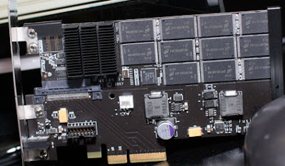

  
[Tomshardware](http://www.tgdaily.com/content/view/34065/135/) has a preview of an upcoming piece of computer hardware called the IODrive, by Fusion IO. By sticking lots of flash memory chips onto a PCI-express board with a pretty serious parallel memory controller for all the flash chips, Fusion IO has been able to achieve what would seem to be the ideal memory system for modern computers.  
  
With the near zero access latency of flash memory, combined with the transfer speed hundreds of times faster than regular flash memory chips today due to its parallel technology, this device has the best of both worlds when it comes to speed.  
  
What does this matter? Conventional hard drives have been one of the greatest bottlenecks of speed in computer's today. Imagine a computer that could boot up Windows Vista in just seconds. Never see another loading screen in a computer game again. Or have even the largest of desktop applications open up instantly.  
  
Did I forget to mention the capacity of the drives will scale from 80GB, up to even a massive 1.2TB. But at a cost of 30$/GB, only those with deep pockets will be able to afford this solution.