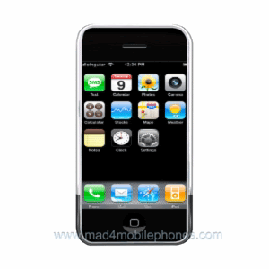

  
  
You pretty much would of had to been stuck in a coma for the last two weeks to of missed all the media hype behind the newly announced Apple *iPhone.* As the name implies, this handheld electronic device is a cellular phone. It's also though an iPod that can playback music and video, as well as surf the web with its built-in browser. Spiffy stuff I must say.  
  
Now for the nasty details that you may not of read about:  
  
* [The release date for the US will be July 2007](http://i.nconspicuo.us/2007/01/09/apple-iphone-cost-and-release-date/). Europe should expect it later that year, with Asia finally getting it sometime in 2008.
  
* The cellular service provider for the iPhone will be only Cingular (AT&T). This is bad news for those Verizon users.
  
* [Cingular does not have full coverage across the US](http://www.engadget.com/2007/01/17/who-wont-be-getting-the-iphone/), and what about poor Canada?
  
* It will be very expensive! [Expect to pay almost 2000$ USD](http://gizmodo.com/gadgets/cellphones/iphone-roundup-true-cost-3d-and-ringtones-229094.php) in fees after just the first year for the iPhone and the carrier services.
  
* Although the iPhone's price is 499$ (4GB) or 599$ (8GB) USD, that is with a two year Cingular contract. eek!
  
* The costs don't end there, with worry over the fact that your downloaded iTunes songs may not be usable as ringtones-- meaning you may need to pay twice for the same song if you wish to use it as your ringtone also.
  
* There are no buttons on the iPhone. It's simply a big screen. Apple has a way of winning people over with risky concepts though, and usually their simplistic engineering ideas tend to work well, but people may still prefer the feeling of ol' tactile buttons!
  
* Big screens break easily and you can believe me when I tell you that your Best Buy super duper extended warranty won't be covering that.
  
* Although the iPhone is capable of playing back videos, its screen aspect ratio is neither widescreen (16:9) or fullscreen (4:3). Instead, it's somewhere in the middle of those, meaning any movie you watch will either be cropped to fit or have black bars around it.
  
* [The product name 'iPhone' is currently undergoing a legal battle.](http://www.cbc.ca/technology/story/2007/01/10/cisco-apple.html) Apparently Cisco Systems belives they already have the rights to that name, so the name iPhone is not yet set in stone.
  
* Lastly, although 5 hours of talktime/video/browsing and 16 hours of audio playback sounds like a fair amount of battery life, it will still be an annoyance for many users. Nightly chargings for some users might be required. eek! I've heard rumours that there may be two batteries though, one dedicated for the phone part, which may not be so bad after all.

  
Regardless of all the potential negatives of the Apple iPhone I've listed here, it's safe to say still that this device will have a definite impact on cell phones of the future and will be successful even if it sucks. Proof in point, the iPod Shuffle. :)