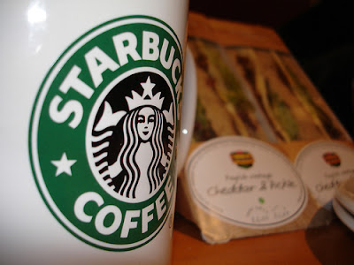

  
One thing I enjoy being aware of is trends in our society, as they can cast shadows of our future. Well, one recent trend that is becoming apparent is the reduction of trans fats from our foods. First in the grocery stores on random products, then with my french fries at the local fast food joint, and now at Starbucks. That's right, Starbucks has silently been making their offerings trans fat free. I know there are a few readers out there who will enjoy hearing that news.   
  
Mmm.. speaking of Starbucks... I'll be right back.  
  
[Source](http://www.consumerist.com/consumer/starbucks/starbucks-removes-trans-fats-what-225466.php)