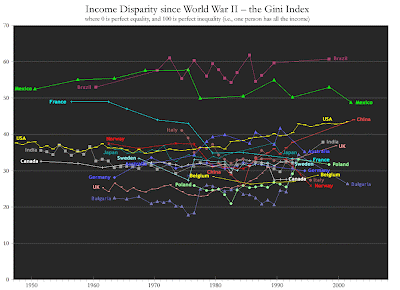
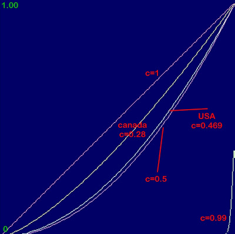

 The above chart is of the Gini Index, from several countries, over the last few decades. The higher the Gini Index value for one country, the *more **inequality*** there is in that country regarding wealth. As in  
  
[1967](http://en.wikipedia.org/wiki/1967 "1967"): 0.397 (first year reported)  
[1968](http://en.wikipedia.org/wiki/1968 "1968"): 0.386 (lowest coefficient reported)  
[1970](http://en.wikipedia.org/wiki/1970 "1970"): 0.394  
[1980](http://en.wikipedia.org/wiki/1980 "1980"): 0.403  
[1990](http://en.wikipedia.org/wiki/1990 "1990"): 0.428  
[2000](http://en.wikipedia.org/wiki/2000 "2000"): 0.462  
[2005](http://en.wikipedia.org/wiki/2005 "2005"): 0.469 (most recent year reported; highest coefficient reported)  
  
Let me make an equation, that's probably incorrect, to graph the Gini Coefficient as a Lorrenz Curve.  
  
Let y = x^(1/(1-c)), where 0<=x,y,c<=1.0 where y represents the relative wealth of an individual where x represents the relative amount of individuals with equal or lesser wealth relative to y and where c is the Gini Coefficient   
   
Below is the graphed results.   
