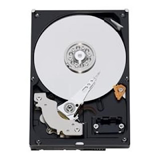

I purchased a 500GB Western Digital RE3 hard drive the other day to replace a failed OCZ Vertex SSD.  I needed something dependable, so the Raid Edition 3 series seemed like a good choice.  It has a 16MB cache and a SATA II interface. It says right on the drive that it is an enterprise class solution, with a 5 year warranty.  Very expensive however, nearly double the cost of the standard WD Black edition drives.  

  

The particular model number for this drive is WD5002ABYS - 02B1B0 , manufactured on Feb 17, 2010.  Although I haven't physically checked, it would strongly appear that this drive uses 2-platters.  There is a black seal over the screw holes, among other hints to believe this.  

  

Running HDTach, performance numbers showed read speeds to vary between ~122MB/s and ~65MB/s, with an average read speed of 99.8MB/s.  Comparing this to the standard WD Black 500GB dual-platter series, this drive performed only about 1-percent better in sequential read speeds, as they typically have an average read speed of about 98MB/s. Random access was 12.3ms, burst speed was 232.2MB/s, with 4% CPU usage on a 1.8GHz dual core.  

  

Conclusion  

If you are looking for pure performance you are best off searching for a single platter 500GB drive or a dual platter drive of larger capacity.  It doesn't need to be a Black edition drive, as some of the high density Blue edition drives can achieve average rates of over 110MB/s.  There are plenty of reviews online of particular drive models to help you figure that out, but to help you narrow your search for a particular model or batch of drives, check out [this website](http://bit.ly/aQhel5).  

  

As for the WD RE3 500GB that I reviewed here, I would recommend it only if it fits your size requirements and  if you are looking for an inexpensive enterprise class solution.  Finding another WD drive of the RE3 series with just a single platter might be your best bet if you want maximum performance and reliabilty however.  The 320GB RE3 does come in a single platter flavor that I regret now not buying instead, but it was not available at the time of purchase for me.  There are also new large capacity 500GB/platter raid edition drives from WD, but they cost a considerably more.