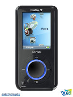

Introducting a new weekly addition to The Tomorrow Times  
**Based on the trends from popular search queries of Google.**  
  
  
**What's Hot?** Television series, House.   
Who doesn't like watching a jerk with a limp insult people. It's fun to make a drinking game out of it with friends actually - take a shot each time he cuts someone up. I guarantee you won't make it through one episode.  
  
**What's Not?** The OC.  
It had a good run, but since Mischa Barton's 'OC' character was killed, the show just wasn't the same. As such, Fox recently has announced it will be cancelling the series. The finale airing will be on February 22nd  
  
  
**What's Hot?** Konvicted - Akon Featuring Snoop Dogg  
  
  
**What's Not?** Fallout Boy.  
Peaking in popularity at the beginning of 2006, the emo band has since died out. No comment.   
  
  
  
  
**What's Hot?** Facebook.com and Myspace.com  
At times I wonder if it's all just a popularity contest...  
  
**What's Not?** Livejournal.com  
If you don't adapt, you don't survive. Sorry Livejournal.  
  
  
**What's Hot?** Digg.com   
  
**What's Not?** Slashdot.org  
Poor slashdot. Digg.com is kicking your ass.  
  
**What's Hot?** The Sandisk Sansa E200  
A direct bitch slap to the iPod. Word is getting around.  
  
**What's Not?** The iPod  
Yes, I know the iPod is more popular. That's not disputed. What is disputed is that the Sansa is exponentially gaining popularity, while the iPod's popularity has stagnated in the last 8 months. And yes, I do know people with Sandisks.  
  
**What's Hot?** Ubuntu  
Even I have it installed. I rest my case.  
 **What's Not?** Linux  
Seriously, if I hear one fanboy say otherwise, I am going to go kick a kitten! And yes, I am very well aware of the fact that Ubuntu is a Linux build. It is however possible for one to be gaining popularity while the other is not.  
  
**What's Hot?** Diets. Well, it's the classic new years resolution. What do you expect.  
  
**What's Not?** Trans fats. Seems that trans fats are a no no this year, with a general transition of fast foods now being prepared trans fat free.  
  
  
**What else is Not?**  
not: Cadillacs  
not: Ringtones  
not: Reality tv  
not: Flannel  
not: Bisexuals  
not: Sudoku  
not: Computers  
not: World of Warcraft  
not: Angelina Jolie  
not: Jessica Alba  
  
  
**What else is hot?**  
hot: Disney  
hot: Naruto  
hot: Wikipedia  
hot: Ivanka Trump  
hot: Dota - I can't believe people are still playing this.  
hot: Ovulation calculators -- uh oh. Baby Boomer 3.0?