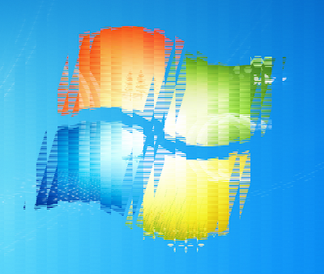

# Windows 7 Annoyances

*Author: Steve*
*Published on: 2009-10-26T15:12:00.001-04:00*

---

  
  
So Windows 7 has arrived and we can now all start installing it. From my own personal experience of using the beta, the RC, and the final build over the course of the last 10 months, I'd say it is a good operating system. While I don't feel it is worth spending $120 to upgrade to in all cases, if you are able to get if at a discount, either by pre-ordering it or by getting a student discount, it may be worth your while. It may also be worth your while if you are using Windows XP or Windows Vista Home Basic and are looking to upgrade to Windows 7 Home Premium on the cheap.  
  
I do feel Windows 7 is better than both Windows XP and Windows Vista; maybe not a dramatic improvement, but it offers few faults. Windows 7 feels about 10-percent faster than Vista, it has a clean-looking design that is refreshing to look at, and it has a new task bar that some users find helps out their productivity. To help things out, unlike when Windows Vista first launched, Windows 7 seems to have fewer incompatibilities, better support and no annoying features off the starting blocks. Both UAC and Windows Activation are seemingly transparent when the operating system is first installed, and all of my system drivers were identified during the install without even being connected to the Internet. When I visited Lenovo.com for more recent drivers, I was greeted to all the drivers and applications that I was looking for.  
  
However, the excitement ends here, as this is where I ran into my first problems. The Intel 4500MHD video drivers I had installed were a bit glitchy; I had this graphical problem in the Windows 7 beta too, but I had hoped by the release day the glitch would be fixed. It is not a serious problem, but it is annoying from time to time. There are some workarounds, but being such a common issue, it is surprising that is has not been resolved yet.  
  
The problems continue; since the computer I am using (a Thinkpad T400) has both a discrete and integrated graphics card, in Windows Vista I was able to choose which card I wanted to use at any time with the press of a button. In Windows 7, support for switchable graphics has been thrown out the window, so to speak, as the only way now to switch between graphics solutions is to do a hard reset and modify the BIOS. Very annoying. Considering how much I loved this feature, the benefits of Windows 7 are not really able to compare, and so I somewhat regret upgrading. However, I shall stick it out and hope that Lenovo finds a way to offer switchable graphics in Windows 7.  
  
There is yet another problem I have noticed with Windows 7 and that is my with my usable available memory. I installed the 32-bit version of Windows 7 since my computer has only 3GB of memory; which is the amount Windows Vista detected as usable. However, in Windows 7 32-bit, only 2.46GB is detected as usable. This is probably due to my switchable graphics solution not having proper drivers, but this is pretty annoying. I am essentially forced to now re-install Windows 7, but this time the 64-bit version, just to get my full 3GB of memory to be usable--a highly inefficient alternative, IMO.  
  
In an attempt to see though which is a better option though, I will test to see which version of Windows 7 is faster-- the 32-bit version with 2.46GB of usable memory, or the 64-bit version with of usable 3GB of memory. (turns out only 2.9GB is available in 64-bit).  
  
Results...  
  
windows vista 32 bit  
superpi mod 1.5, 1M = 21.0s  
  
windows 7 32 bit,  
superpi mod 1.5, 1M = 20.6s  
sunspider javascript test =1008.2ms  
battery life @ idle, = 8:35  
(power-source optimized, Intel 4500MHD, low brightness, extended battery@88% original capacity, wifi/bluetooth on)  
  
windows 7 64 bit,  
superpi mod 1.5, 1M = 21s  
sunspider javascript test =1019.8ms  
battery life @ idle,= 7:25  
(power-source optimized, Intel 4500MHD, low brightness, extended battery@88% original capacity, wifi/bluetooth on)  
  
Conclusion, so it turns out even though in 64-bit mode I had more usable memory, 64-bit mode didn't really improve performance. In fact, it seemed like 64-bit mode was a percent or two slower in speed than 32-bit. As for battery life, although the test was based on estimated battery life via the battery life meter, 64-bit mode seemed to offer an hour less battery life in idle mode.  
  
Guess I'm going back to 32-bit mode until I upgrade my RAM; either with Windows 7 or Windows Vista. Hopefully I can figure out a way of increasing the usable memory in 32-bit back up to 3GB in Windows 7, instead of the 2.46GB offered to me now- I'd like to feel like Windows 7 does more good than harm for my user experience.