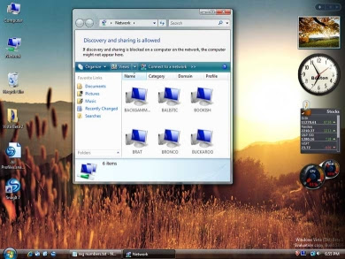

  
Microsoft's next version of Windows, called Windows Vista, will be released to the public next month. The main attraction of Windows Vista for most people will be its looks, thanks to a new graphical interface called 'Aero'. Beauty comes at a price though and with high demands. Not only is the software a bit pricey, but the minimum computer system requirements are steep. Don't expect your three year old laptop to run it.  
  
For most users, it might be nice to know that Microsoft has released Windows Vista in several different flavors, each with different features activated with respective pricing. The basic version, Vista Home Basic, does not have the fancy 'Aero' interface included, so I would suggest as a buyer to avoid this version completely. The version most users will opt for most likely will be Vista Home Premium, at a price of $239USD, which offers plenty of media functions while only really lacking in the corporate networking and security features, that most home users never use.  
  
For the ultimate user, there is Vista Ultimate, which offers all the media functions of Vista Home Premium and all the functions of the business flavors, at a pricey $399USD. In case you are not sure of what you want, Microsoft will let you upgrade your package later on over the internet, through a potentially easy process. As well, upgrade packages from Windows XP to Windows Vista will be available, which will be offered at a reduced price.  
  
Ultimately, for most users, Windows Vista will not be needed for a few years more. Those who are looking for a fancy interface and gamers looking to play the newest DirectX 10 games though will want to upgrade sooner however.  
  
For more information on Windows Vista, and to see the packaging options, [CLICK HERE](http://www.extremetech.com/article2/0,1697,2068721,00.asp)