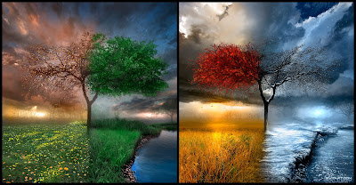
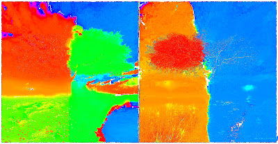
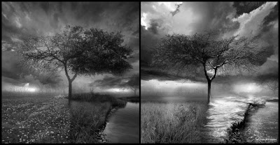
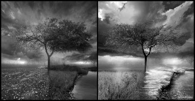
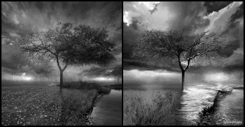

# a digital study of Colour

*Author: Steve*
*Published on: 2009-05-03T00:26:00.000-04:00*

---

I've been doing some programming lately (coding an application to load onto my camera that makes the camera capable of taking high dynamic range photos natively), but writing this application has made me notice a few things about the colour, light intensity and tone of a digital image. There are some things I have taken for granted really about working with coloured images in photoshop, never really having dealt with the nitty gritty details of image enhancements that I'm forced to learn all about now. I feel like sharing a couple of these interesting insights, however obvious they seem to be.  
  
First off, lets explore how important the varying levels of brightness is to a photo. Take, for example, this following image.  
  
(Image credit of Alexiuss @ http://alexiuss.deviantart.com/art/Seasonscape-69489448)  
  
It's a lovely image, but lets see what happens to the image when we remove the varying levels of brightness (or shading I guess you could call it); we're just going to leave behind the colour hues.  
  
We are left now with a colorful, but rather confusing, image made up of several main colors: cyan, green, yellow, red, magenta, and blue. White represents an area lacking colour. Even though a coloured image in principal requires three times more information than a black and white image, all that added information provides relatively little use on it own it seems.  
  
Next, lets look at the opposite effect; turning a coloured image into a black and white (gray scale) image. The thing is, how do you do this? If there are three colour channels in a coloured image, (Red, Green, and Blue,) how best do you combine them to make just one black and white channel?  
  
  
First up, it seemed logical to me to just average all three RGB colour channels to make the black and white image: the above is the outcome. Overall, I was pleased with this first result, but after reading up some more on the behaviour of light, color and human perception, I realized that the ideal method might not be just so simple.  
  
One thing to realize is that the human eye sees different luminosities for each of the three main RGB colours. In the above image, the ratios 0.3 : 0.6 : 0.1 were used to combine (add up) the RGB channels to make just one whole channel. The idea is, the human eye sees green as being 6 times as bright as blue and twice as bright as red. But is this even the best method?  
  
   
The above image was produced by squaring each of the RGB colour channels, adding up the results, and then rooting that sum. I actually really liked this result; it makes some sense that the brightness of a color might not be linear in nature, but even if that is not the case, visually I found this result the most appealing.   
  
  
Lastly, I wanted to see how my paint application defined brightness to see if I could duplicate how it might produce a black and white image from a colored image. Its method was actually performed by taking the lowest and highest valued channel (per coloured pixel) of the three RGB channels and just averaging them-- completely ignoring the third colour channel! The above is the result.   
  
In the end, I have tested 4 different methods of producing a black and white image from a coloured image- and there are probably a dozen more other ways yet unmentioned here. I wish I could say there was 'a best' method, but it appears that it all comes down to personal preference. Some of the methods may be considered more accurate, numerically or perceptually, and other ways may just look nicer. In the end, it may not really matter, as the end results of the different methods were all still very similar. Can you see the differences?  
  
For something that seemed at first so simple, I'm amazed to find that working with coloured images at the nitty gritty level becomes quite the chore. My headaches do not end there however, as modifying and combining the dynamic ranges of multiple images introduces new challenges as well. It turns out that just averaging two identical photos (with just different exposures) produces pretty decent results! It may not be the best method of producing an HDR image, but it sure is easy. (bonus: simply averaging the images also seems to reduce image noise!)