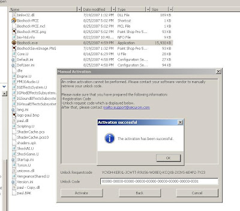

**update:: okay, so i lied. the paul.dll i do not have yet cracked... yet. i just wanted to join in on all the cracking fun. stupid CS.RIN.RU and demoniod.com won't let me register to join their fun. so im just having my own fun here.   
  
the progress i have made so far has been interesting though, im taking a slightly different route than i was yesterday when i started this attempt. if anyone has their matching unlock code and unlock requestcode that they used to activate their game via manual activation, i would love to have a copy of that. i think i can crack it with that info. if you have a memory dump also, @ the manual activation screen like below, i would also love to have that.**  
  
disclaimer:  
i am not currently linking to or hosting any files on this website. i don't live in the USA. so screw off.   
  
  
  
proof? the crack involves modding the paul.dll file.   
  
instructions:  
  
1. get bioshock installation files.  
2. get bioshock mini image.  
3. load mini image with daemon tools.  
4. install game.  
5. replace paul.dll file with cracked dll.  
6. run bioshock.exe  
7. enter any unlock code.  
8. PLAY AWAY!  
  
now, since i am god damn broke, if you want this crack released public (fully working version), i need to start seeing paypal donations! :)  
  
(you can donate on the right menu bar)  
  
when i get enough donated, i'll make it public. otherwise, fuck off. go buy the damn game. what the hell do i care about you? and if you don't got cash, at least check out my advertisers. when i can pay my month's rent, you can play.  
  
cheers,  
~steve